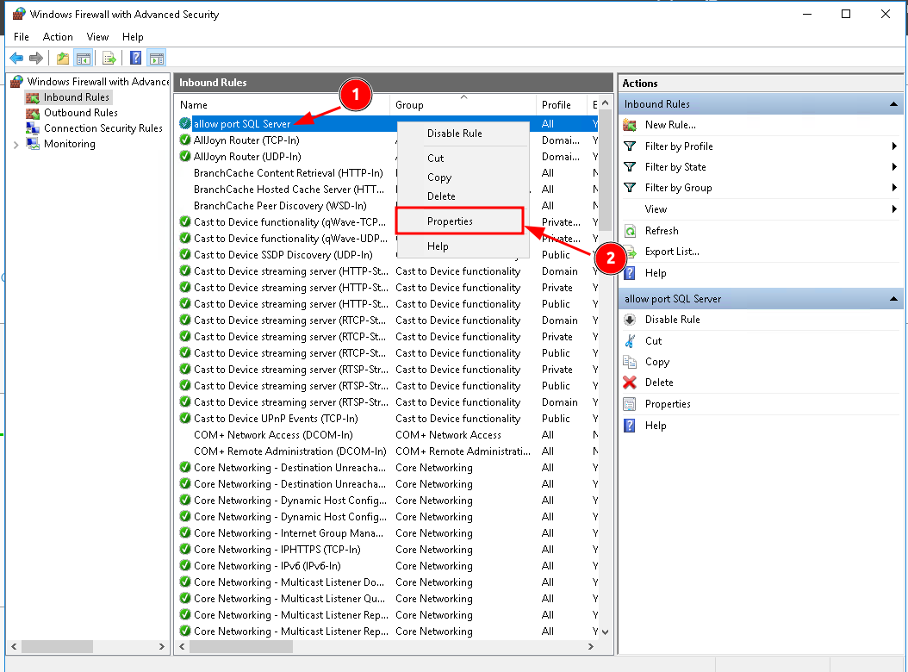
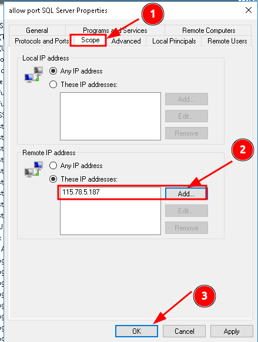
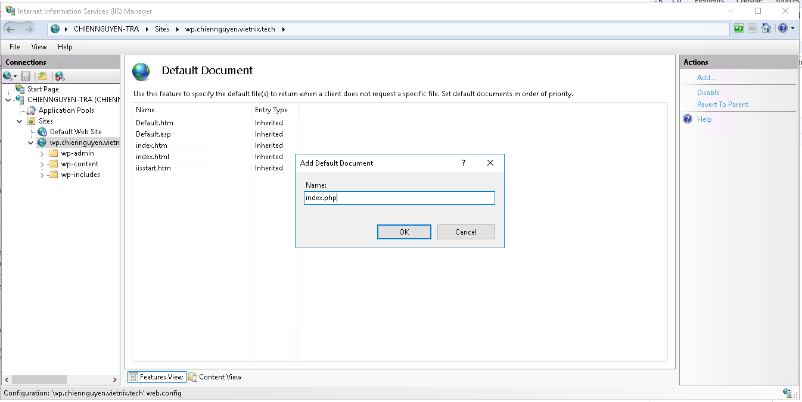

# NGUYỄN MINH CHIẾN - NỘI DUNG TÌM HIỂU 20/09/2025
## Windows Server
### 1. Firewall
Để cấu hình firewall trên Windows Server, ta có thể sử dụng giao diện Windows Firewall with Advanced Security hoặc cấu hình bằng cmd netsh. Ở đây em sử dụng giao diện
####  Allow/block port, allow/block ip trên window fw
- Truy cập vào giao diện Windows Firewall

- Vào phần Inbound Rule -> New Rule để add thêm Rule mới. Inbound Rules sẽ Áp dụng rule cho các kết nồi từ bên ngoài vào server.

- Cấu hình các thông tin như hình

- Sau khi tạo rules, điều chỉnh allow kết nối và allow ip kết nối.

- Truy cập vào Advanced, cấu hình Edge Traversal. quyết định liệu rule có cho phép lưu lượng đi qua NAT (Network Address Translation) hoặc router để đến được server hay không. Có 4 lựa chọn:
    - **Block edge traversal**: Chặn các gói tin từ ngoài NAT (chỉ cho phép lưu lượng từ local subnet).
    - **Allow edge traversal**: Cho phép các gói tin đã NAT (từ bên ngoài) đi vào qua rule này. ta cần chọn để cho phép truy cập từ Internet thông qua NAT.
    - **Defer to user**: Hỏi người dùng khi có gói tin edge traversal.
    - **Defer to application**: Ứng dụng quyết định có cho phép hay không.

- Vào Scope, cấu hình cho phép remote ip truy cập vào.

- Từ máy client, sử dụng telnet để  kiểm thử truy cập vào port 1433 (SQL Server) của server.

- Đối với việc  block port/ip thực hiện tương tự như ở allow, chỉ riêng phần Action thay vì chọn `allow the connection` ta sẽ chọn `block the connection`.
### 2. IIS
#### Cài đặt IIS Server.
- Vào phần Add Role and features để cài đặt IIS.

- Chọn các role để cài đặt cho IIS, ở đây ngoài cái role cơ bản thì ta cần phải cài đặt thêm CGI cho việc deploy Wordpress. CGI cho phép IIS chạy được các ứng dụng hoặc script trung gian, đặc biệt là PHP, vốn là ngôn ngữ chính của WordPress. khi người dùng gửi một request tới website WordPress, IIS sẽ thông qua CGI để chuyển tiếp request đó cho PHP xử lý, sau đó trả lại kết quả về cho IIS để hiển thị cho người dùng. Nhờ có CGI, WordPress mới có thể hoạt động đúng trên nền tảng IIS, vì bản thân IIS không hỗ trợ trực tiếp PHP.

- Xác nhận cài đặt

### 3. Tạo website WordPress

- Tạo một site mới:
Truy cập vào Tools -> IIS Manager tạo một site mới cho Wordpress.

Cấu hình thông tin của site, bao gồm domain, physical path (đường dẫn vào docRoot), bind (à thông tin kết nối giữa domain, IP, port và giao thức).

- Cài đặt MySQL: Truy cập vào trang MySQL để tải xuống mysql. Sau khi tải xuống thì cài đặt theo lựa chọn bên dưới.

Sau khi cài đặt, truy cập vào cmd của mysql để tạo một database cho wordpress và user để  database kết nối tới.

- Cài đặt PHP
 Truy cập trang chủ để cài đặt PHP. Sau đó vào mục Hander Mapping. Tại đây, ta sẽ tạo một Script Map dùng để trỏ đến file thực thi của PHP (ví dụ: php-cgi.exe) nằm trong thư mục cài đặt PHP. Script Map này sẽ định nghĩa rằng mọi file có phần mở rộng .php khi được IIS nhận request sẽ không xử lý trực tiếp, mà sẽ chuyển qua PHP Engine thông qua CGI. Điều này giúp IIS hiểu được mã nguồn PHP và trả về kết quả cho người dùng cuối.

- Cài đặt wordpress từ trang chủ. Sau đó giải nén file cài đặt vào thư mục docRoot của site.

Mặc định, IIS thường ưu tiên các file như index.html hoặc default.aspx khi người dùng truy cập vào thư mục gốc mà không chỉ định file cụ thể. Tuy nhiên, với WordPress thì file khởi đầu quan trọng lại là index.php. Vì vậy, ta phải vào mục Default Document trong IIS Manager và thêm index.php vào danh sách, đồng thời sắp xếp nó ở vị trí ưu tiên cao nhất.

Cấu hình wp-config.php trỏ đến databases và user đã được cấu hình trên mysql.

Từ trình duyệt truy cập vào domain để kiểm thử.

- Cài đặt SSL.
Đối với chứng chỉ SSL trên IIS, định dạng chuẩn được hỗ trợ là .pfx, bởi vì .pfx chứa cả certificate (crt/ca) và private key (key) trong một gói duy nhất, đồng thời có thể đặt thêm mật khẩu bảo vệ. IIS không thể nhận trực tiếp file .crt hoặc .key, nên ta cần phải chuyển đổi về .pfx trước khi import vào server. Ta có thể sử dụng OpenSSL để chuyển hoặc truy cập vào một số trang online có hỗ trợ tạo file .pfx theo crt,ca,key. Em sử dụng cách 2.

- Sau khi tạo cert. Truy cập vào phần Server Certificates -> Action để import file .pfx vừa tạo.

- Sau khi đã import thành công chứng chỉ SSL dưới dạng .pfx vào IIS, bước tiếp theo là cấu hình HTTPS binding cho website. Trong IIS Manager, ta chọn site cần cấu hình, nhấn vào Binding ở phần Actions, sau đó tạo một binding mới và điền thông tin.

- Sau khi tạo, restart lại site và truy cập vào domain với https để kiểm thử.

