# NGUYỄN MINH CHIẾN - Nội dung 04/09/2025

## I. SSL
### 1. Khái niệm
- Là một tiêu chuẩn của công nghệ bảo mật, truyền thông mã hóa giữa trình duyệt và máy chủ web server.
- SSL hoạt động và đảm bảo rằng những dữ liệu được truyền tải giữa máy chủ và trình duyệt đều được toàn vẹn, riêng tư và bảo mật.
### 2. Các cách xác thực SSL
- **Domain Validation – DV SSL**
    - Chứng chỉ xác thực tên miền dành cho các website cá nhân với khả năng mã hóa cơ bản.
    - Chỉ yêu cầu xác minh quyền sở hữu của tên miền.
    - Xác thực SSL với ba cách
        - Xác thực qua email, cần tạo email dạng admin@domain để nhận mail apppoval từ phía SSL.
        - Xác thực qua DNS, cấu hình 1 bản ghi theo yêu cầu từ phía SSL.
        - Xác thực qua File Base, người dùng sẽ nhận được nội dung của file xác thực kèm đường dẫn để người dùng khởi tạo file theo đường dẫn được cung cấp trên server / hosting người dùng.
- **Organization Validation – OV SSL**
    - Chứng chỉ xác thực dành cho các tổ chức và doanh nghiệp có độ tin cậy cao.
    - Xác thực bao gồm việc xác minh quyền sở hữu tên miền, xác minh doanh nghiệp đăng ký đang tồn tại và hoạt động bình thường.
    - Tên doanh nghiệp cũng sẽ được hiển thị chi tiết trên chứng chỉ OV được cấp.
- **Extended Validation – EV SSL**
    - Loại chứng chỉ xác thực mở rộng, có độ tin cậy cao nhất thường được sử dụng cho các doanh nghiệp và tổ chức đang hoạt động.
    - Tuân thủ nghiêm ngặt các quy định của tổ chức CA trong quá trình xác minh doanh nghiệp.
    - Khi truy cập vào website sẽ thấy chứng chỉ EV trên thanh địa chỉ của browser xuất hiện màu xanh lá cây và đồng thời sẽ xuất hiện tên doanh nghiệp sở hữu website đó. 
- **Wildcard SSL Certificate – Wildcard SSL**
    - Dành cho các website có nhu cầu sử dụng SSL cho nhiều subdomain khác nhau.
    - Có thể chạy cho nhiều subdomain khác nhau và không bị giới hạn và chỉ cần một chứng chỉ SSL duy nhất.
- **Subject Alternative Names – SANs SSL**
    - Là loại chứng chỉ được thiết kế cho các ứng dụng Communication của Microsoft, Lync, Web Hosting và QA Testing.
    - Bảo vệ nhiều tên miền con khác nhau, mức độ bảo mật cao hơn Wildcard SSL.
    - Sự dụng cùng với nhiều loại SSL khác.
### 3. CSR File
- Là một khối văn bản được mã hóa, chứa thông tin định danh của người yêu cầu chứng chỉ SSL và khóa công khai (Public Key) tương ứng.
- Đảm bảo rằng người yêu cầu thực sự có quyền kiểm soát tên miền và sở hữu Khóa riêng (Private Key) bí mật tương ứng với Public Key trong CSR.
### 4. Gen file CSR và request SSL cho domain `tech.training.vietnix.tech` bằng OpenSSL.
- **Bước 1**: Tạo Private Key

    ```bash
    openssl genrsa -out tech.training.vietnix.tech.key 2048
    ```
    Giải thích:
    - Sinh private key RSA 2048-bit và lưu vào `tech.training.vietnix.tech.key`.  
    - **Giữ file này thật bí mật** (ví dụ `chmod 600 tech.training.vietnix.tech.key`).  
    - Key này dùng để tạo CSR và sẽ dùng khi cài certificate trên server.

- **Bước 2**: Tạo CSR

    ```bash
    openssl req -new -key tech.training.vietnix.tech.key -out tech.training.vietnix.tech.csr
    ```
    Sau khi thực hiện lệnh sẽ hiển thị các trường thông tin cần điền:
    - **Country Name (C)**: mã quốc gia 2 chữ (ví dụ `VN`) — quốc gia của tổ chức.  
    - **State or Province (ST)**: tên tỉnh/tiểu bang (ví dụ `Ho Chi Minh`).  
    - **Locality (L)**: thành phố (ví dụ `Ho Chi Minh`).  
    - **Organization (O)**: tên công ty/tổ chức (ví dụ `Vietnix`).  
    - **Organizational Unit (OU)**: phòng/ban (ví dụ `Training`) — tùy chọn.  
    - **Common Name (CN)**: **PHẢI nhập chính xác `tech.training.vietnix.tech`** (CA sẽ dùng CN để xác định domain cho chứng chỉ).  
    - **Email / challenge password**: thường để trống hoặc nhập tuỳ chọn — không bắt buộc.  
    > Lưu ý: nếu CN sai hoặc không khớp domain, CA có thể từ chối cấp chứng chỉ.

- **Bước 3**: Kiểm tra nội dung CSR
    ```bash
    openssl req -in tech.training.vietnix.tech.csr -noout -text
    ```
    - Xem phần `Subject` để xác nhận CN và các thông tin khác đúng.  
    - Vì không dùng SAN ở đây, chú ý CN là trường quyết định domain.


- **Bước 4**: Gửi CSR cho CA và giữ key an toàn

    - Gửi file `tech.training.vietnix.tech.csr` cho Certificate Authority tùy chọn (DigiCert,Sectigo,GlobalSign,...).  
    - **KHÔNG gửi** file `tech.training.vietnix.tech.key` cho bất kỳ ai.  
    - Sau khi CA cấp, họ trả về certificate (ví dụ `tech.training.vietnix.tech.crt` hoặc `.pem`) — dùng certificate này kèm private key để cài trên server.

### 5. Pem file
- Là một định dạng tệp được sử dụng rộng rãi để lưu trữ và truyền tải các chứng chỉ số, khóa mật mã, và các dữ liệu bảo mật khác trong các hệ thống mã hóa.
- Thường có phần mở rộng là .pem, .crt, .cer, hoặc .key và được mã hóa bằng Base64.
- Cho phép dữ liệu bảo mật được dễ dàng trao đổi và sử dụng trong các ứng dụng khác nhau.
### 6. Private key SSL
- Là file mã hoá được sinh ra cùng lúc khi tạo CSR.
- Đóng vai trò xác thực máy chủ và giải mã dữ liệu.
### 7. PFX file
#### Khái niệm
- Là một loại tệp định dạng khóa cá nhân chứng thực (certificate) trong hệ thống Windows. 
- Chứa cả chứng thực số và khóa riêng tư được mã hóa.
- Cung cấp thông tin bảo mật cho các kết nối an toàn như HTTPS (HTTP Secure), SMTPS (SMTP Secure), và các dịch vụ khác.
#### Cách chuyển dổi tử  CRT sang PFX
- Trường hợp 1: Có CRT, CA Bundle và Private Key
    ```bash
    openssl pkcs12 -export \
    -out domain.pfx \
    -inkey domain.key \
    -in domain.crt \
    -certfile ca-bundle.crt
    ```
    - Giải thích tham số:
        - -out domain.pfx : file PFX đầu ra
        - -inkey domain.key : private key tương ứng
        - -in domain.crt : chứng chỉ chính (CRT)
        - -certfile ca-bundle.crt : chứng chỉ trung gian (CA Bundle), nếu được CA cung cấp
- Trường hợp 2: Chỉ có CRT và Private Key
    ```bash
    openssl pkcs12 -export \
    -out domain.pfx \
    -inkey domain.key \
    -in domain.crt
    ```
- Kết quả sau khi chạy
    - OpenSSL sẽ yêu cầu nhập Export Password : mật khẩu này dùng khi import file .pfx vào hệ thống
    - File .pfx sẽ chứa: chứng chỉ (CRT) + private key + (tùy chọn) CA chain

## II. Domain
### 1. Khái niệm
- Là một chuỗi ký tự dễ nhớ, được sử dụng để xác định một địa chỉ trên Internet.
- Giúp người dùng dễ dàng tìm thấy, ghi nhớ và truy cập website.
### 2. Các trạng thái của domain
#### Nhóm trạng thái hoạt động và bảo vệ
- **OK / active**: Tên miền đang hoạt động bình thường, không có lệnh cấm hoặc hạn chế nào đang chờ xử lý.
- **clientTransferProhibited**: Nhà đăng ký đã đặt lệnh cấm chuyển tên miền sang một nhà đăng ký khác.
- **clientUpdateProhibited**: Nhà đăng ký đã đặt lệnh cấm cập nhật thông tin tên miền.
- **clientDeleteProhibited**: Nhà đăng ký đã đặt lệnh cấm xóa tên miền.
#### Nhóm trạng thái có vấn đề và cần chú ý
- **clientHold**: Nhà đăng ký tên miền (Vietnix) đã tạm ngưng hoạt động phân giải DNS của tên miền.
- **serverHold**: Cơ quan quản lý tên miền cấp cao (VNNIC, Verisign) đã tạm ngưng phân giải DNS.
- **redemptionPeriod (hoặc Pending Delete Restorable)**: Tên miền đã hết hạn, không được gia hạn trong thời gian gia hạn thông thường (Grace Period) và đã vào giai đoạn chuộc lại (thường khoảng 30 ngày).
- **pendingDelete**: Tên miền đã qua redemptionPeriod mà không được chuộc, đang trong hàng đợi xóa vĩnh viễn (thường 5-7 ngày sau redemptionPeriod).
- **pendingTransfer**:  Có yêu cầu chuyển nhượng tên miền sang Nhà đăng ký khác đang được xử lý.
- **addPeriod**: Giai đoạn ngắn sau khi đăng ký mới, có thể xóa và hoàn phí (tùy TLD). Thường không yêu cầu hành động.
- **autoRenewPeriod**: Một số TLD tự động gia hạn, cho phép hủy sau đó.
- **renewPeriod**: Giai đoạn sau khi gia hạn, cho phép hủy gia hạn (tùy chính sách).
### 3. Subdomain
- Là một phần được thêm vào phía trước tên miền chính, được ngăn cách bởi dấu chấm.
- Cho phép tạo ra các phân mục hoặc các website riêng biệt nhưng vẫn nằm dưới sự quản lý của tên miền chính.
### 4. Virtual Hosts
- Là một tính năng trong web server và cũng là một phương thức lưu trữ.
- Cho phép nhiều trang web hoặc tên miền hoạt động trên cùng một máy chủ vật lý hoặc một địa chỉ IP duy nhất

## III. Mail Server
### 1. MX Record
- Là một bản ghi (Record) trong DNS, thực hiện định vị máy chủ mail cho tên miền.
- Với mỗi tên miền, người dùng có thể gán nhiều MX record.
- Dù email tạm thời bị gián đoạn hoặc không hoạt động trong một thời gian, nhưng dữ liệu vẫn không hề bị mất.
### 2. DKIM, SPF, PTR
#### DKIM
- Một phương thức giúp xác nhận Email thông qua chữ ký số giúp tránh và chặn  email giả mạo, lừa đảo, mã độc.
- Email gửi đi sẽ được gắn chữ ký điện tử liên kết với tên miền; người nhận xác minh bằng cách tra cứu khóa công khai (Public Key) trong DNS.
#### SPF
- Cơ chế xác thực email giúp phát hiện và ngăn chặn email giả mạo. 
- Là một bản ghi TXT được khai báo trong DNS, giúp hệ thống nhận email xác minh địa chỉ IP của máy chủ gửi có hợp lệ hay không.
#### PTR
- Là một loại bản ghi DNS có tác dụng trỏ một địa chỉ IP đến một tên miền.
- Đáp ứng yêu cầu reverse DNS lookup trước khi nhận email.
- Tăng độ tin cậy của server: (hỗ trợ cho outgoing mail server).

## IV. DNS
### Khái niệm
- Là hệ thống phân giải tên miền.
- Cho phép thiết lập tương ứng giữa địa chỉ IP và tên miền trên Internet.
### Các loại Record DNS
- **CNAME Record**: Là một bản ghi tên quy chuẩn (Canonical Name Record). Đây là một dạng bản ghi tài nguyên trong hệ thống tên miền.
- **A Record**: Dùng để trỏ tên miền website tới một địa chỉ IP cụ thể. Đây được xem là bản ghi DNS đơn giản nhất.
- **MX Record**: Bản ghi này bạn có thể sử dụng để trỏ tên miền đến mail server. MX Record chỉ định server nào quản lý các dịch vụ Email của tên miền đó.
- **AAAA Record**: Dùng để trỏ tên miền đến địa chỉ IPv6 và cho phép thêm host mới, TTL và IPv6.
- **TXT Record**: Ngoài ra, có thể thêm giá trị TXT, Host mới, TTL và Point To để chứa các thông tin định dạng văn bản domain.
- **SRV Record**: Đây là bản ghi DNS đặc biệt, dùng để xác định chính xác dịch vụ nào đang chạy Port nào. Và thông qua bản ghi này bạn có thể thêm Priority, Port, Weight, TTL, Point to Point.
- **NS Record**: Bản ghi này có thể chỉ định Name Server cho từng tên miền phụ và bên cạnh đó có thể tạo tên Name Server, TTL hay host mới.
### Nguyên tắc làm việc của DNS
- **DNS Server phân giải tên miền**: Mỗi nhà cung cấp dịch vụ hay tổ chức đều có hệ thống DNS Server riêng để quản lý và phân giải tên miền của mình.
- **Phân giải tên miền đúng thẩm quyền**: Khi cần tìm địa chỉ IP của một website, việc phân giải phải do DNS Server của tổ chức quản lý tên miền đó trả lời, chứ không phải từ DNS của một tổ chức khác.
- **Khả năng tra vấn lẫn nhau**: DNS Server có thể gửi truy vấn đến các DNS Server khác để lấy kết quả phân giải nếu nó chưa có.
- **Cơ chế ghi nhớ (caching)**: DNS Server lưu lại (cache) các kết quả phân giải vừa thực hiện, để trả lời nhanh hơn cho những truy vấn sau.
### Cách phân giải địa chỉ DNS
- **Người dùng gửi yêu cầu**: Khi nhập tên miền vào trình duyệt, một yêu cầu sẽ được gửi đến Recursive DNS Server.
- **Recursive DNS Server tìm kiếm**: Recursive DNS Server thực hiện các bước tìm kiếm thông tin từ Root DNS Server đến Authoritative DNS Server.
- **Authoritative DNS Server cung cấp địa chỉ IP**: Server cuối cùng cung cấp địa chỉ IP tương ứng với tên miền.
- **Recursive DNS Server nhận địa chỉ IP**: Được cung cấp địa chỉ IP, Recursive DNS Server trả về thông tin cho trình duyệt và cập nhật bộ nhớ đệm.
- **Trình duyệt kết nối đến máy chủ web**: Trình duyệt sử dụng địa chỉ IP để kết nối đến máy chủ web và tải trang web.

## V. Linux Command Line
### Ping và Hping3
#### Ping

- Giải thích
    - `ttl=` là số hop (router) gói tin đi qua còn lại trước khi bị hủy. Giá trị càng cao nghĩa là gói chưa qua nhiều hop.
    - `time=` độ trễ (round-trip time) từ máy nguồn đến đích và ngược lại.

#### Hping3
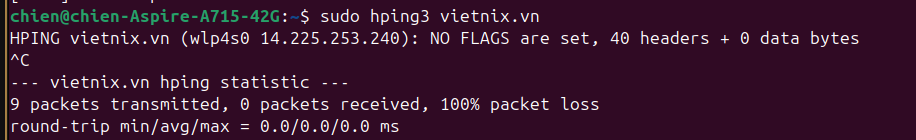
- Giải thích
    - hping3 mặc định gửi gói TCP, không phải ICMP.
    - Server không phản hồi loại gói này → 100% packet loss.
    - round-trip = 0.0 ms vì không có phản hồi nào.
    - Không đồng nghĩa với server "chết", chỉ là server không phản hồi gói tin này.

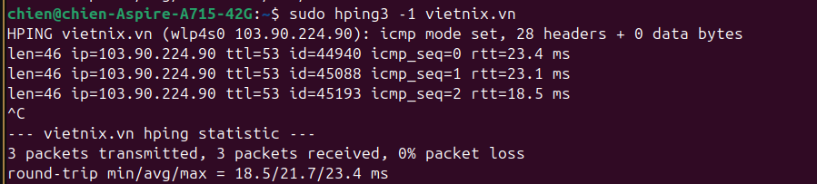   
- Giải thích
    - len: độ dài gói ICMP.
    - ip: địa chỉ IP đích phản hồi.
    - ttl: số hop còn lại.
    - id: ID của gói ICMP.
    - icmp_seq: thứ tự gói.
    - rtt: thời gian round-trip (ms).
    - Thống kê cuối: số gói gửi/nhận, % gói mất, RTT min/avg/max.

#### So sánh
- `ping`: luôn dùng ICMP Echo Request/Reply, đơn giản để kiểm tra kết nối.
- `hping3` (mặc định): gửi TCP packet → dễ bị firewall chặn, thường không phản hồi.
- `hping3 -1`: dùng ICMP mode, kết quả tương tự ping nhưng hiển thị thêm chi tiết (len, id).
- Điểm khác biệt: Ping chỉ test ICMP, còn Hping3 có thể tùy biến TCP/UDP/ICMP để phân tích sâu hơn hoặc kiểm thử bảo mật.
### SSH Command
- Kết nối bằng password.
    ```bash
    ssh username@hostname
    ```
- kết nối bằng key.
    ```bash
    ssh -i /path/to/private_key username@hostname
    ```
    
- Kết nối bằng port custom
    ```bash
    ssh -i ~/.ssh/id_rsa -p 2222 chien@192.168.1.100 ## 2222 là port tùy chỉnh so với port gốc 22 của SSH 
    ```

### SCP Command
+ Copy một file:
    ```bash
    scp file.txt user@remote:/path/to/destination/        # copy file từ local lên remote
    scp user@remote:/path/to/file.txt /local/path/        # copy file từ remote về local
    ```

+ Copy một folder:
    ```bash
    scp -r folder/ user@remote:/path/to/destination/      # copy folder từ local lên remote
    scp -r user@remote:/path/to/folder/ /local/path/      # copy folder từ remote về local
    ```

---

### Rsync Command
+ Copy file:
    ```bash
    rsync -av file.txt user@remote:/path/to/destination/  # copy file với rsync
    ```

+ Copy folder:
    ```bash
    rsync -av folder/ user@remote:/path/to/destination/   # copy folder với rsync
    ```

+ `rsync incremental`:
    ```bash
    rsync -av --progress /source/ /destination/           # chỉ copy phần thay đổi (incremental)
    rsync -avz /source/ user@remote:/path/to/destination/ # incremental qua SSH
    ```

### Cat Command
+ Xem nội dung 1 file:
    ```bash
    cat file.txt
    ```

+ Xem dòng thứ `<n>` trong file:
    ```bash
    sed -n '<n>p' file.txt
    ```
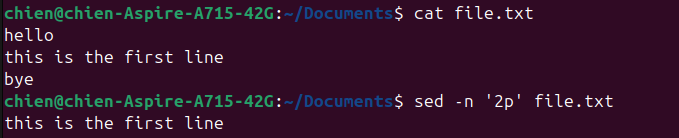
+ Ghi nhiều dòng vào 1 file bằng EOF:
    ```bash
    cat <<EOF > file.txt
    line 1
    line 2
    line 3
    EOF
    ```
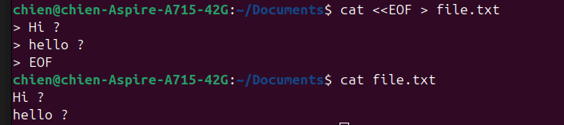

### Echo Command:
+ Chèn thêm 1 dòng vào cuối file:
    ```bash
    echo "Content" >> file.txt
    ```
+ Overwrite (ghi đè toàn bộ nội dung file):
    ```bash
    echo "Content" > file.txt
    ```
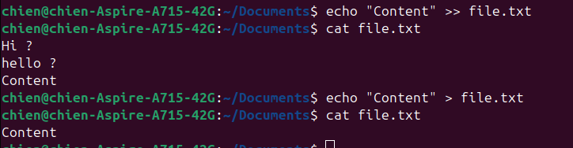

### Tail/Head Command:
+ Sự khác biệt giữa `tail` và `head`.
    - `head`: Hiển thị dòng đầu tiên của file (mặc định 10 dòng đầu).
    - `tail`: Hiển thị dòng cuối cùng của file (mặc định 10 dòng cuối).
+ Sự khác biệt giữa `tail` và `tailf`.
    - `tail`: Chỉ hiển thị n dòng cuối của file tại thời điểm chạy lệnh.
    - `tailf`: Hiển thị n dòng cuối, và tiếp tục “theo dõi” file khi có dòng mới được ghi vào file (thường dùng để xem log).

### Sed Command:
+ Find and replace string trong file.
    + Thay đổi, chuỗi bị trùng lần đầu tiên trong mỗi dòng, không thay đổi file gốc
        ```bash
        sed 's/old_string/new_string/' file.txt
        ```
        - s: substitute (thay thế)
        - old_string: chuỗi cần tìm
        - new_string: chuỗi thay thế
    + Thay kế tất cả chuỗi bị trùng trong file, không thay đổi file gốc
        ```bash
        sed 's/old_string/new_string/' file.txt
        ```
        - g: global, thay thế tất cả các lần xuất hiện trong dòng
    + Thay đổi trực tiếp file gốc (in-place):
        ```bash
        sed -i 's/old_string/new_string/g' file.txt
        ``` 
        - -i: ghi đè trực tiếp vào file.txt

### Traceroute/Tracert Command:
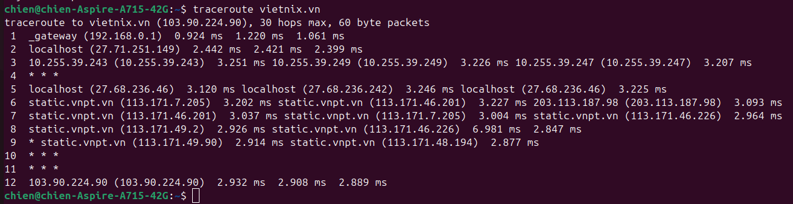
+ Giải thích: Kết quả traceroute vietnix.vn cho thấy đường đi của gói tin từ máy khách đến server vietnix.vn (IP 103.90.224.90), với tối đa 30 hop và gói tin 60 bytes. Giải thích từng phần:
    - Hop 1: Là router/gateway tại mạng LAN, Thời gian hiển thị 3 lần đo round-trip time (ms) cho từng gói.
    - Hop 2: Hiển thị ISP hoặc router trung gian
    - Hop 3: Một số hop nội bộ của ISP, sử dụng IP Private
    - Hop 4: Router không trả lời ICMP, gói tin tiếp tục đi.
    - Hop 5-9: Gói tin đi qua các router của VNPT, một số hop có nhiều IP do load balancing hoặc nhiều đường đi trong ISP
    - Hop 10-11: một số router trung gian không trả lời, gói tin tiếp tục đi bình thường
    - Hop 12: Hiển thị server đích (vietnix.vn) và độ trễ từ máy khách đến server.

### Netstat Command:

+ Hiển thị các socket đang listen:
    ```bash
    netstat -l
    ```

+ Không resolve hostname:
    ```bash
    netstat -n
    ```
    Địa chỉ IP sẽ hiển thị thay vì tên host.

+ Không resolve portname:
    ```bash
    netstat -n
    ```
    Port sẽ hiển thị dưới dạng số (vd: 22, 443) thay vì dịch sang tên dịch vụ (ssh, https).

+ Display process name/PID:
    ```bash
    netstat -p
    ```

+ Chỉ hiển thị socket TCP:
    ```bash
    netstat -t
    ```

+ Chỉ hiển thị socket UDP:
    ```bash
    netstat -u
    ```
### Sort Command:
+ Theo thứ tự tăng dần.
    ```bash
    sort file.txt
    ```
+ Theo thứ tự giảm dần.
    ```bash
    sort -r file.txt
    ```
+ Theo column.
    ```bash
    sort -k <column_number> file.txt
    ```
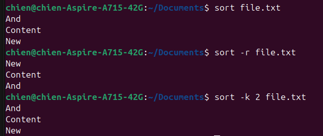

### Uniq Command:
+ Lọc các dòng lặp lại.
```bash
uniq file.txt
```
+ Lọc và đếm số lượng dòng lặp lại.
```bash
uniq -c file.txt
```
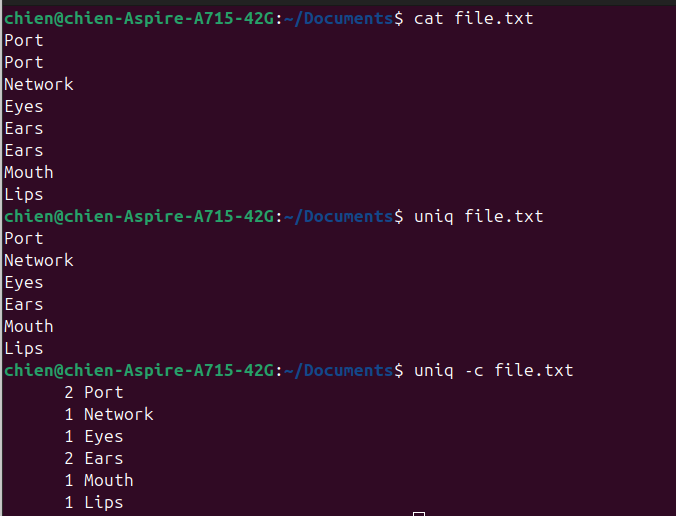

### Wc Command:
+ Đếm số dòng:
    ```bash
    wc -l file.txt
    ```
+ Đếm số ký tự (xuống dòng cũng tính là 1 ký tự):
    ```bash
    wc -m file.txt
    ```
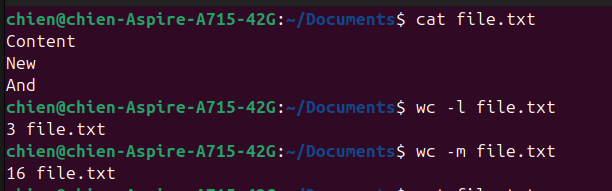

### Chmod, Chown, Chattr Command:
+ Phân quyền bằng số (octal) hoặc chữ (symbolic):
    ```bash
    chmod 755 file.txt        # rwxr-xr-x
    chmod u+x file.txt        # thêm quyền execute cho user
    chmod g-w file.txt        # bỏ quyền write của group
    ```

+ Đổi owner user/group:
    ```bash
    sudo chown user file.txt              # đổi owner user
    sudo chown user:group file.txt        # đổi owner và group
    ```

+ Set Immutable Attribute (không cho sửa/xóa file):
    ```bash
    sudo chattr +i file.txt   # set immutable
    lsattr file.txt           # kiểm tra attribute
    sudo chattr -i file.txt   # bỏ immutable
    ```

### Find Command:
+ Tìm file đuôi `.log`:
    ```bash
    find /path/to/search -type f -name "*.log"      # tìm file có đuôi .log
    ```

+ Tìm folder tên `abc`:
    ```bash
    find /path/to/search -type d -name "abc"        # tìm folder tên abc
    ```

+ Tìm file tên `abc`:
    ```bash
    find /path/to/search -type f -name "abc"        # tìm file tên abc
    ```

+ Tìm file `abc` và đặt quyền read only:
    ```bash
    find /path/to/search -type f -name "abc" -exec chmod 444 {} \;   # chmod read-only
    ```

### Cp Command:
+ Copy file.
    ```bash
    cp file.txt /path/to/destination/
    ```
+ Copy folder (dùng tùy chọn `-r` để copy đệ quy):
    ```bash
    cp -r folder_name/ /path/to/destination/
    ```

### Mv Command:
+ Di chuyển/đổi tên file/folder.
    + Đổi tên file:
        ```bash
        mv old_name.txt new_name.txt
        ```

    + Đổi tên folder:
        ```bash
        mv old_folder new_folder
        ```

    + Di chuyển file vào thư mục khác:
        ```bash
        mv file.txt /path/to/destination/
        ```

    + Di chuyển cả folder:
        ```bash
        mv folder/ /path/to/destination/
        ```
### Cut Command:
+ Lấy ký tự thứ `<n>`.
    ```bash
    echo "abcdef" | cut -c <n> ## n là STT ký tự muốn lấy
    ```
+ Lấy từ ký tự `<n>` trở về sau.
    ```bash
    echo "abcdef" | cut -c <n>-
    ```
+ Lấy đến ký tự thứ `<n>`.
     ```bash
    echo "abcdef" | cut -c -<n>
    ```

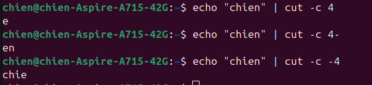

### Dig Command:
+ Kiểm tra record A, MX, NS:
    ```bash
    dig A example.com
    dig MX example.com
    dig NS example.com
    ```
+ Kiểm tra record A, MX, NS với custom DNS (ví dụ: 8.8.8.8):
    ```bash
    dig @8.8.8.8 A example.com
    dig @8.8.8.8 MX example.com
    dig @8.8.8.8 NS example.com
    ```

### Tar/Zip/Unzip Command:
+ Nén/giải nén `tar.gz`.
    + Để nén file, sử dụng lệnh:
        ```bash
        tar -czvf archive.tar.gz folder_name/
        ```
        + c: create (tạo file nén)
        + z: dùng gzip
        + v: verbose (hiển thị chi tiết)
        + f: file (tên file nén)
    + Để giải nén file, sử dụng lệnh:
        ```bash
        tar -xzvf <file_name>.tar.gz
        ```
+ Nén/giải nén `.zip`.
    + Để nén file/thư mục, sử dụng lệnh:
        ```bash
        zip -r archive.zip folder_name/
        ```
        + r: nén đệ quy (bao gồm toàn bộ file/thư mục con)
    + Để giải nén file, sử dụng lệnh:
        ```bash
        unzip <file_name>.zip
        ```

### Mount/Umount Command:
+ Thêm ổ cứng `sdb` ~ 5gb.
+ Kiểm tra số lượng ổ cứng:
    ```bash
    lsblk
    ```
    hoặc:
    ```bash
    fdisk -l
    ```
+ Mount vào `/mnt/test`:
    ```bash
    sudo mkdir -p /mnt/test
    sudo mount /dev/sdb /mnt/test
    ```
+ Umount `/mnt/test`:
    ```bash
    sudo umount /mnt/test
    ```

### Symbolic Links, Hard Links Command:
+ Định nghĩa Sym Link: 
    - Là một file đặc biệt chứa đường dẫn tham chiếu đến file hoặc folder khác. Nếu file gốc bị xóa, symlink sẽ không còn giá trị.
+ Định nghĩa Hard Link: 
    - Là một file tạo ra một tham chiếu trực tiếp tới inode của file gốc.
    - Inode là nơi lưu trữ thông tin về file (metadata và vị trí dữ liệu trên ổ đĩa).
    - Hard link và file gốc chia sẻ cùng inode, nên nếu file gốc bị xóa, dữ liệu vẫn tồn tại thông qua hard link.
+ Ví dụ về Sym Link và Hard Link.

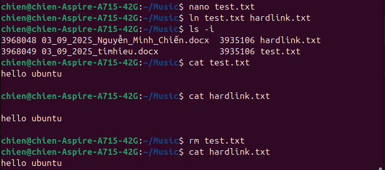

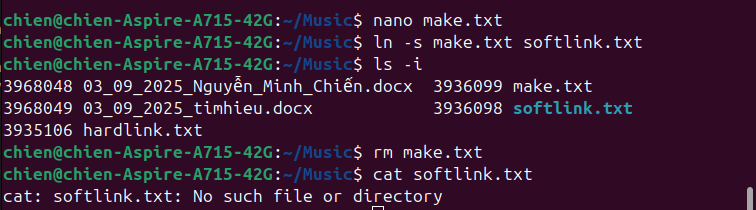


### Ls Command:
+ Liệt kê file/thư mục:
```bash
    ls
```
+ Liệt kê file/thư mục và thuộc tính.
```bash
    ls -l
```
+ Show file ẩn.
```bash
    ls -a
```
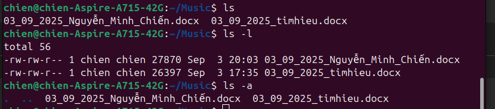

### Ps Command:
+ Show tiến trình: Hiển thị tất cả tiến trình đang chạy sử dụng lệnh:
    ```bash
    ps aux
    ```
+ Kill tiến trình: 
    + Kill tiến trình theo ID:
        ```bash
        kill <PID> ## với PID là ID của tiến trình
        ```

    + Kill tiến trình theo tên:

        ```bash
        pkill <process_name> ## với process_name là tên tiến trình
        ```

### Top Command:
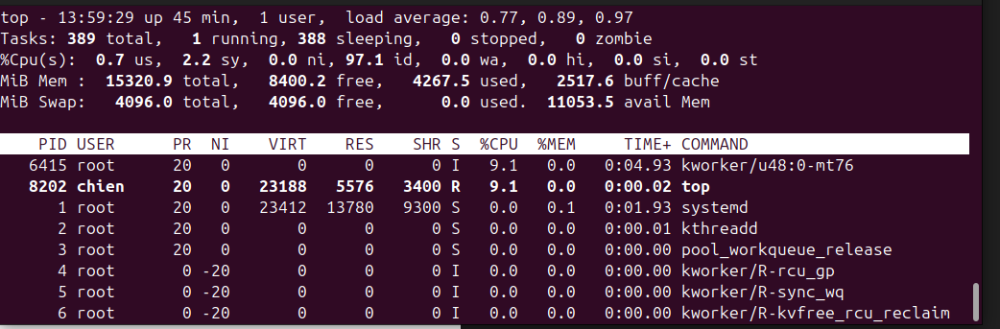
- Giải thích các thông số.
    - Phần trên cùng:
        + Load average: mức tải CPU trong 1, 5, 15 phút.
        + Tasks: số tiến trình và trạng thái của các tiến trình.
        + %Cpu(s): sử dụng CPU.
        + Mem / Swap: thông tin RAM và swap.
    - Phần danh sách tiến trình.
        + PID: ID của tiến trình.
        + USER: user sở hữu tiến trình.
        + PR / NI: độ ưu tiên (priority, nice value).
        + VIRT: bộ nhớ ảo.
        + RES: RAM thực sự dùng.
        + SHR: bộ nhớ chia sẻ.
        + S: trạng thái (R=Running, S=Sleeping, Z=Zombie).
        + %CPU / %MEM: % sử dụng CPU/RAM.
        + TIME+: tổng thời gian CPU dùng cho tiến trình.
        + COMMAND: tên lệnh / tiến trình.

### Free Command:
- Giải thích các thông số về RAM:

    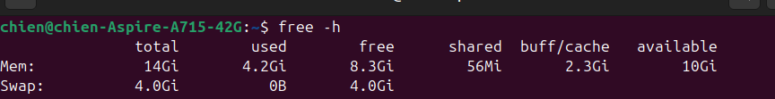
    + total: tổng dung lượng RAM.
    + used: RAM đang được sử dụng.
    + free: RAM chưa dùng.
    + shared: bộ nhớ dùng cho tmpfs (chia sẻ giữa các process).
    + buff/cache: RAM dùng cho buffer & cache (Linux tận dụng RAM trống để tăng tốc).
    + available: RAM còn có thể dùng thực tế (quan trọng hơn cột free).
    + Swap: không gian trên disk dùng làm bộ nhớ ảo.

### Df Command:
- Xem dung lượng disk: Để xem dung lượng disk, sử dụng 
    ```bash
    df -h
    ```
    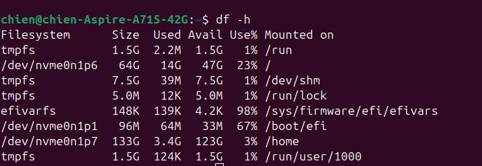
    - Filesystem: Tên của hệ thống file (vị trí lưu trữ dữ liệu trên ổ đĩa).
    - Size: Tổng dung lượng của hệ thống file.
    - Used: Dung lượng đã sử dụng.
    - Available: Dung lượng còn trống.
    - Use%: Tỷ lệ phần trăm dung lượng đã sử dụng.
    - Mounted on: Vị trí mà hệ thống file được gắn kết vào (file trong cây file của Linux.
- Phân vùng `/`:
    - Là gốc của toàn bộ cây thư mục trong hệ thống.
    - Chứa file hệ điều hành và các chương trình cơ bản.
    - Chứa các file cấu hình của hệ thống và người dùng

