# NGUYỄN MINH CHIẾN - NỘI DUNG 05/09/2025
## I. LEMP
### 1. Khái niệm
- LEMP Stack là một bộ công nghệ mã nguồn mở bao gồm các thành phần Linux, Nginx (thường được phát âm là “Engine-X”), MySQL (hoặc MariaDB) và PHP (hoặc Python). Đây là một cấu hình phổ biến được sử dụng trong việc phát triển và triển khai các ứng dụng web, đặc biệt là các website có khả năng mở rộng cao và yêu cầu hiệu suất tối ưu.

    - **Linux (L)**: Là hệ điều hành nền tảng cho các phần mềm và dịch vụ chạy trên server.
    - **Nginx (E)**: Là một web server và reverse proxy server, nổi bật với khả năng xử lý lượng lớn kết nối đồng thời mà không làm giảm hiệu suất.
    - **MySQL (M)**: Là một hệ quản trị cơ sở dữ liệu quan hệ phổ biến, giúp lưu trữ và quản lý dữ liệu cho website.
    - **PHP (P)**: Là ngôn ngữ lập trình được sử dụng để xử lý các logic và mã động trên server.

### 2. Xây dựng mô hình LEMP
#### a. Truy cập vào VPS bằng SSH
- Sử dụng câu lệnh sau để đăng nhập bằng password với user (cụ thể là root).
    ```bash
    ssh user@<VPS_IP>
    ```
    #### b. Cài đặt HĐH Linux
    - Sử dụng lệnh sau để kiểm tra HĐH mà VPS đang sử dụng.
    ```bash
    root@chiennguyen-training-0509:~# lsb_release -d
    Description:	Ubuntu 22.04.4 LTS
    ```
#### c. Cài đặt Nginx
- Cập nhật và cài đặt Nginx
    ```bash
    sudo apt update
    sudo apt install nginx -y
    ```
- Sau khi cài đặt, khởi động, bật Nginx khi boot:
    ```bash
    root@chiennguyen-training-0509:~# sudo systemctl start nginx
    root@chiennguyen-training-0509:~# sudo systemctl enable nginx
    Synchronizing state of nginx.service with SysV service script with /lib/systemd/systemd-sysv-install.
    Executing: /lib/systemd/systemd-sysv-install enable nginx
    ```
- Kiểm tra trạng thái của Nginx:
    ```bash
    root@chiennguyen-training-0509:~# sudo systemctl status nginx
    ● nginx.service - A high performance web server and a reverse proxy server
        Loaded: loaded (/lib/systemd/system/nginx.service; enabled; vendor preset:>
        Active: active (running) since Fri 2025-09-05 09:10:20 +07; 47s ago
        Docs: man:nginx(8)
    Main PID: 14720 (nginx)
        Tasks: 7 (limit: 11924)
        Memory: 8.2M
            CPU: 38ms
        CGroup: /system.slice/nginx.service
                ├─14720 "nginx: master process /usr/sbin/nginx -g daemon on; maste>
                ├─14722 "nginx: worker process" "" "" "" "" "" "" "" "" "" "" "" ">
                ├─14723 "nginx: worker process" "" "" "" "" "" "" "" "" "" "" "" ">
                ├─14724 "nginx: worker process" "" "" "" "" "" "" "" "" "" "" "" ">
                ├─14725 "nginx: worker process" "" "" "" "" "" "" "" "" "" "" "" ">
                ├─14726 "nginx: worker process" "" "" "" "" "" "" "" "" "" "" "" ">
                └─14727 "nginx: worker process" "" "" "" "" "" "" "" "" "" "" "" ">

    Sep 05 09:10:20 chiennguyen-training-0509 systemd[1]: Starting A high performan>
    Sep 05 09:10:20 chiennguyen-training-0509 systemd[1]: Started A high performanc>
    lines 1-19/19 (END)
    ```
- Truy cập vào server bằng IP Public:
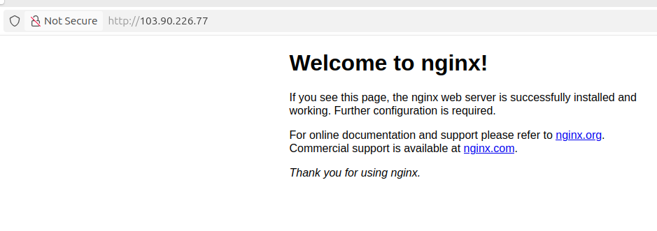

#### d. Cài đặt MySQL
- Cập nhật và cài đặt MySQL
    ```bash
    sudo apt update
    sudo apt install mysql-server
    ```
- Sau khi cài đặt, bật MySQL và tự động khởi động khi boot:
    ```bash
    sudo systemctl start mysql.service
    sudo systemctl enable mysql.service
    ```
- Cấu hình bảo mật MySQL để thay đổi một số thiết lập bảo mật kém:
    ```bash
    sudo mysql_secure_installation
    ```
    - Prompt đầu tiên yêu cầu thiết lập Validate Password Plugin – dùng để kiểm tra độ mạnh mật khẩu của user MySQL mới trước khi công nhận là hợp lệ.

        Nếu đồng ý thiết lập Validate Password Plugin, mọi user MySQL được tạo và chọn xác thực bằng mật khẩu sẽ bắt buộc phải tạo mật khẩu dựa trên các chính sách  đã chọn.

        Trên Ubuntu, MySQL 8 mặc định root login bằng auth_socket.nghĩa là root Linux (sudo) có thể login MySQL mà không cần password. Vì vậy, mysql_secure_installation bỏ qua việc đặt password cho root.
    ```bash
    Securing the MySQL server deployment.

    Connecting to MySQL using a blank password.

    VALIDATE PASSWORD COMPONENT can be used to test passwords
    and improve security. It checks the strength of password
    and allows the users to set only those passwords which are
    secure enough. Would you like to setup VALIDATE PASSWORD component?

    Press y|Y for Yes, any other key for No: Y

    There are three levels of password validation policy:

    LOW    Length >= 8
    MEDIUM Length >= 8, numeric, mixed case, and special characters
    STRONG Length >= 8, numeric, mixed case, special characters and dictionary                  file

    Please enter 0 = LOW, 1 = MEDIUM and 2 = STRONG: 2

    Skipping password set for root as authentication with auth_socket is used by default.
    If you would like to use password authentication instead, this can be done with the "ALTER_USER" command.
    See https://dev.mysql.com/doc/refman/8.0/en/alter-user.html#alter-user-password-management for more information.

    ```

    - Sau khi thiết lập Validat Password Plugin, nhập Y rồi nhấn Enter để đồng ý với các thiết lập mặc định cho những câu hỏi tiếp theo. Thao tác này sẽ xóa một số user ẩn danh và cơ sở dữ liệu test, disable các đăng nhập vào root từ xa, và cuối cùng là tự áp dụng các thay đổi này.

    ```bash
    Remove anonymous users? (Press y|Y for Yes, any other key for No) : y
    Success.


    Normally, root should only be allowed to connect from
    'localhost'. This ensures that someone cannot guess at
    the root password from the network.

    Disallow root login remotely? (Press y|Y for Yes, any other key for No) : y
    Success.

    By default, MySQL comes with a database named 'test' that
    anyone can access. This is also intended only for testing,
    and should be removed before moving into a production
    environment.


    Remove test database and access to it? (Press y|Y for Yes, any other key for No) : y
    - Dropping test database...
    Success.

    - Removing privileges on test database...
    Success.

    Reloading the privilege tables will ensure that all changes
    made so far will take effect immediately.

    Reload privilege tables now? (Press y|Y for Yes, any other key for No) : y
    Success.

    All done! 
    ```
- Sau khi cấu hình bảo mật, kiểm tra việc đăng nhập vào MySQL.
    ```bash
    root@chiennguyen-training-0509:~# sudo mysql
    Welcome to the MySQL monitor.  Commands end with ; or \g.
    Your MySQL connection id is 12
    Server version: 8.0.43-0ubuntu0.22.04.1 (Ubuntu)
    ```
#### e. Cài đặt PHP
- Để cài đặt PHP, chạy lệnh
```bash
sudo apt install php-fpm php-mysql
```
- Truy cập vào file /etc/php/8.1/fpm/php.ini, thay đổi thông số sau từ 1 thành 0 và restart lại php-fpm:
    ```bash
    cgi.fix_pathinfo=0
    ```
    - PHP-FPM dùng PATH_INFO để xác định script PHP khi Nginx gọi.
        - Nếu = 1 (mặc định trên nhiều hệ thống cũ): PHP sẽ thử thực thi file khác nếu file được yêu cầu không tồn tại dẫn đến rủi ro bảo mật, hacker có thể chạy script ngoài dự kiến.
        - Nếu = 0: PHP chỉ thực thi file chính xác được yêu cầu, an toàn hơn với Nginx.
- Kiểm tra
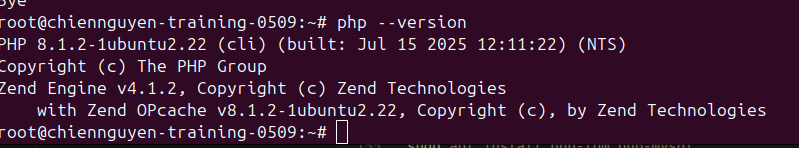

## II. Triển khai website WordPress và Lavarel
### 1. Wordpress
- Tạo thư mục web cho WordPress và cấp quyền:
    ```bash
    sudo mkdir -p /var/www/wordpress
    sudo chown -R www-data:www-data /var/www/wordpress
    sudo chmod -R 755 /var/www/wordpress
    ```
- Đăng nhập và MySQL (bằng `sudo mysql` với user root hoặc `mysql -u root -p` với các user khác), tạo user và database mới cho WordPress.
    
    ```bash
    CREATE DATABASE wordpress_db;
    CREATE USER 'wp_user'@'localhost' IDENTIFIED BY 'mypassword';
    GRANT ALL PRIVILEGES ON wordpress_db.* TO 'wp_user'@'localhost';
    FLUSH PRIVILEGES;
    ```
    - Tạo database có tên 'wordpress_db'
    - Tạo user với password, user này chỉ login được từ nội bộ (localhost).
    - Cấp mọi quyền trên database này cho user, sau đó `FLUSH PRIVILEGES` để áp dụng thay đổi ngay lập tức.
- Tải và cài đặt WordPress
    ```bash
    cd /tmp
    wget https://wordpress.org/latest.tar.gz
    tar -zxvf latest.tar.gz
    sudo cp -r /tmp/wordpress/* /var/www/wordpress
    sudo chown -R www-data:www-data /var/www/wordpress
    ```
    - Sử dụng `wget` cài đặt file nén WordPress từ trang chủ.
    - Copy toàn bộ vào thư mục web vừa tạo.
    - Sử dụng `chown -R` đảm bảo Nginx/PHP-FPM có quyền ghi và đọc file.
- Cấu hình WordPress
    - Tạo file config của WordPress bằng cách copy file mẫu và chỉnh sửa các thông tin database sao cho khớp với thông tin tạo từ MySQL để xác định kết nối.
    ```bash
    sudo cp /var/www/wordpress/wp-config-sample.php /var/www/wordpress/wp-config.php
    sudo nano /var/www/wordpress/wp-config.php
    ```
    - Các thông số chỉnh sử a bao gồm:
    ```bash
    define('DB_NAME', 'wordpress_db');
    define('DB_USER', 'wp_user');
    define('DB_PASSWORD', 'mypassword');
    define('DB_HOST', 'localhost');
    ```
- Cấu hình Nginx để host website WordPress
    - Tạo một file cấu hình Ngĩnx với lệnh dưới đây:
    ```bash
    sudo nano /etc/nginx/sites-available/wp.chiennguyen.vietnix.tech
    ```
    - Cấu hình site WordPress:
        ```bash
            server {
            listen 80;
            listen [::]:80;
            server_name wp.chiennguyen.vietnix.tech;

            root /var/www/wordpress;
            index index.php index.html;

            location / {
                try_files $uri $uri/ /index.php?$args;
            }

            location ~ \.php$ {
                include snippets/fastcgi-php.conf;
                fastcgi_pass unix:/var/run/php/php8.1-fpm.sock;
            }

            location ~ /\.ht {
                deny all;
            }
        }
        ```
        - `listen`: Server lắng nghe trên port 80, cho mọi Ipv4 và Ipv6
        - `server_name`: Domain mà server site này phản hồi. Khi request đến domain này, Nginx sẽ dùng site này.
        - `root`: Thư mục chứa file WordPress.
        - `index`: Xác định trang chỉ mục ưu tiên khi user truy cập thư mục mà không chỉ định file cụ thể.
        - `location`: Chỉ định xử lí root request, file PHP và chặn các file ẩn.
    - Tạo symlink để kích hoạt site:
    ```bash
    sudo ln -s /etc/nginx/sites-available/wp.chiennguyen.vietnix.tech /etc/nginx/sites-enabled/
    ```
    - Kiểm tra cấu hình và reload Nginx:
    ```bash
    root@chiennguyen-training-0509:/tmp# sudo nginx -t
    nginx: the configuration file /etc/nginx/nginx.conf syntax is ok
    nginx: configuration file /etc/nginx/nginx.conf test is successful
    root@chiennguyen-training-0509:/tmp# sudo systemctl reload nginx
    ```
- Truy cập WordPress bằng domain we.chiennguyen.vietnix.tech:
    - Chọn ngôn ngữ
    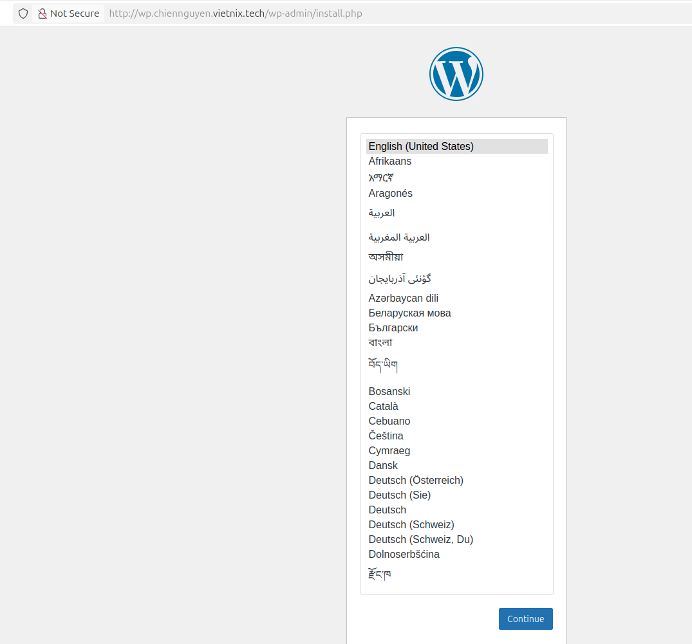
    - Tạo tài khoản đăng nhập:
    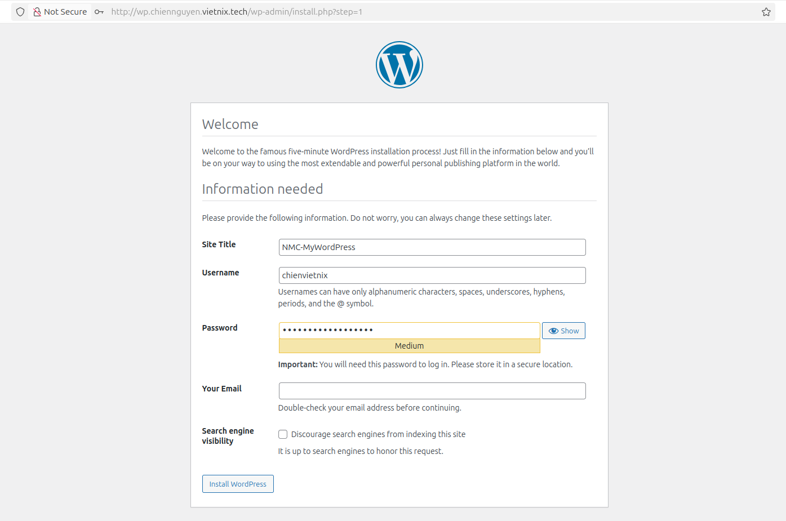
    - Đăng nhập với tài khoản vừa tạo
    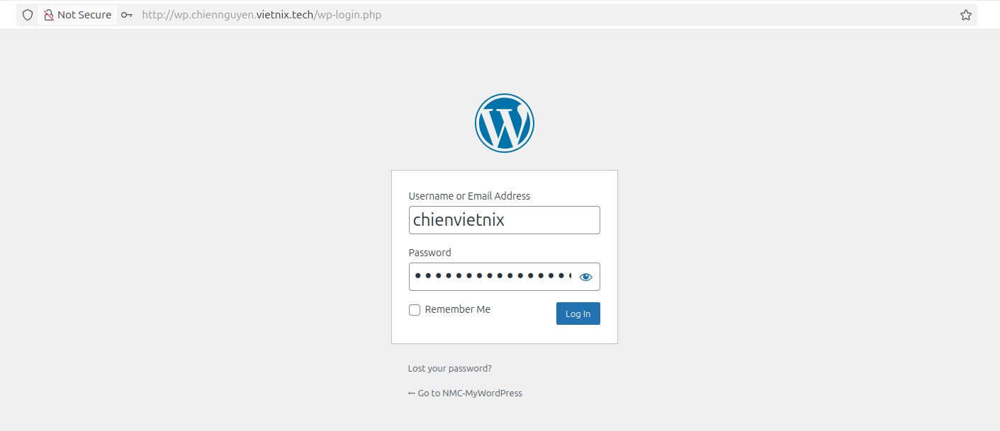
    - Trang dashboard admin của WordPress sau khi đăng nhập thành công
    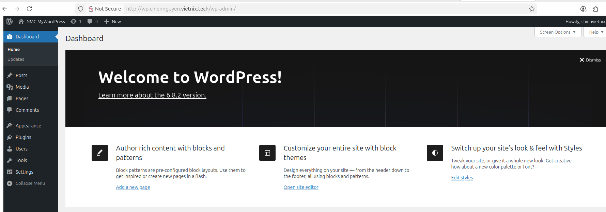
    - Site mẫu được tạo:
    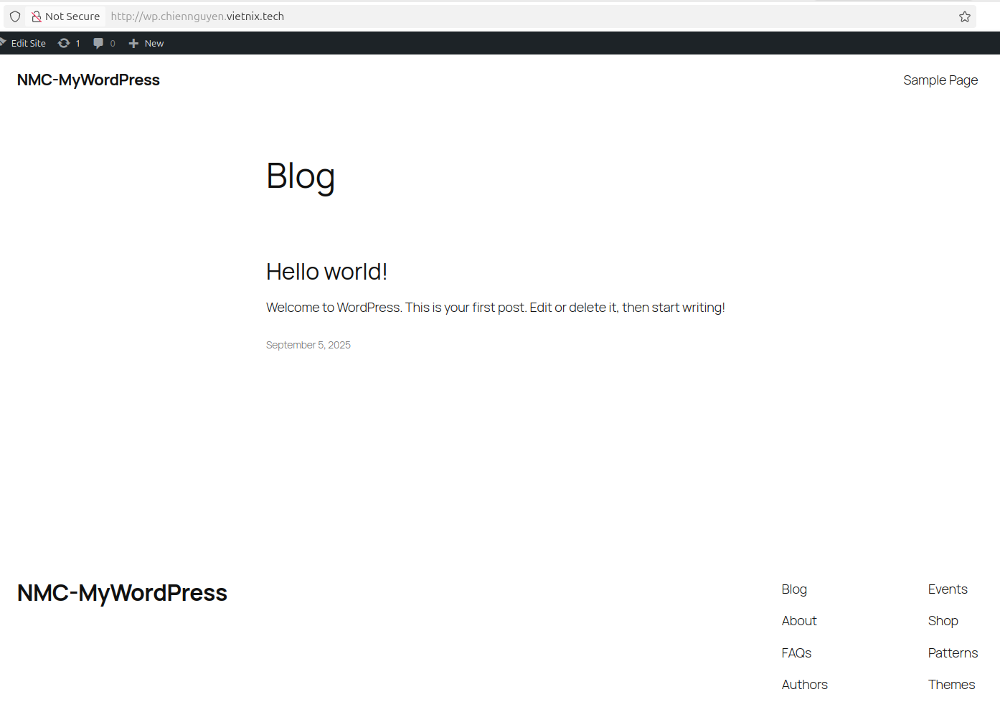

### 2. Lavarel
- Cài đặt một số  extension PHP cần thêm cho Laravel.
    ```bash
    sudo apt install curl php-xml php-cli php-mbstring php-curl git unzip
    ```
- Cài đặt Composer: công cụ quản lý package PHP, dùng để tải Laravel và dependency.
    ```bash
    root@chiennguyen-training-0509:~# cd ~
    root@chiennguyen-training-0509:~# curl -sS https://getcomposer.org/installer -o composer-setup.php
    ```
    - Kiểm tra chuổi HASH trước khi cài đặt. Sau khi hiện trạng thái ` Installer verified`, tiến hành cài đặt Composer.
        ```bash
        root@chiennguyen-training-0509:~# sudo php composer-setup.php --install-dir=/usr/local/bin --filename=composer
        ```
- Tạo thư mục web cho Laravel:
    ```bash
    sudo mkdir -p /var/www/laravel
    sudo chown -R deploy:deploy /var/www/laravel
    ```
    - `mkdir -p`: tạo thư mục, bao gồm các thư mục cha nếu chưa có.
    - `chown`: cấp quyền cho user `deploy` để quản lý file.
    - Sử dụng user `deploy` tạo bởi người dùng thay vì `www-data` như Wordpress bởi vì:
        - WordPress chủ yếu hoạt động theo mô hình request-response, các file PHP chỉ cần quyền đọc; các thao tác ghi hạn chế trong wp-content. Vì vậy, user `www-data` (web server) đủ để thực thi mà không gây rủi ro bảo mật.
        - Laravel là framework MVC đầy đủ, yêu cầu quản lý package (Composer) và thực thi CLI (Artisan); nhiều thư mục cần quyền ghi (storage, bootstrap/cache). Nếu toàn bộ thuộc `www-data`, các tiến trình CLI phải chạy với quyền web server, dễ gây vi phạm nguyên tắc `least privilege`, tăng nguy cơ lỗi permission và khai thác bảo mật.
- Cài đặt Laravel và cấp quyền:
    ```bash
    cd /var/www/laravel
    composer create-project laravel/laravel .
    sudo chown -R www-data:www-data storage bootstrap/cache
    sudo chmod -R 775 storage bootstrap/cache
    ```
    - Lệnh Composer sẽ tải các package cần thiết.
    - Chỉ nên cho phép thư mục storage & bootstrap/cache writable cho `www-data`. Đảm bảo web server có quyền ghi log, cache và storage.
- Tạo database MySQL cho Laravel
    ```bash
    CREATE DATABASE laravel_db;
    CREATE USER 'laravel_user'@'localhost' IDENTIFIED BY 'Lavarel05092025@';
    GRANT ALL PRIVILEGES ON laravel_db.* TO 'laravel_user'@'localhost';
    FLUSH PRIVILEGES;
    ```
- Cấu hình `env` để Laravel kết nối tới database
    ```bash
    cd /var/www/laravel
    cp .env.example .env
    nano .env
    ```
    
    - Các thông tin cần chỉnh sửa:
    ```bash
    DB_CONNECTION=mysql       # Loại database
    DB_HOST=127.0.0.1         # Host MySQL
    DB_PORT=3306              # Port MySQL
    DB_DATABASE=laravel_db    # Tên database vừa tạo
    DB_USERNAME=laravel_user  # User vừa tạo
    DB_PASSWORD=your_password # Password user vừa tạo
    ```
- Tạo app key để mã hóa session và dữ liệu.
    ```
    sudo -u www-data php artisan key:generate
    ```
- Cấu hình Nginx để host website Laravel

    - Tạo một file cấu hình Ngĩnx với lệnh dưới đây:
    ```bash
    sudo nano /etc/nginx/sites-available/laravel.chiennguyen.vietnix.tech
    ```
    - Cấu hình site WordPress:

    ```bash
    server { 
    listen 80; 

    server_name laravel.chiennguyen.vietnix.tech; 
    
    add_header X-Frame-Options "SAMEORIGIN"; 
    add_header X-Content-Type-Options "nosniff"; 
    
    root /var/www/laravel/public; 
    index index.php index.html; 
    
    location / { 
        try_files $uri $uri/ /index.php?$query_string; } 

    location ~ \.php$ { 
        include snippets/fastcgi-php.conf; 
        fastcgi_pass unix:/var/run/php/php8.1-fpm.sock;
        fastcgi_param SCRIPT_FILENAME $realpath_root$fastcgi_script_name; 
        include fastcgi_params; 
        } 
        
        location ~ /\.ht { 
            deny all; 
        } 
    }
    ```
    - `include snippets/fastcgi-php.conf`: nạp cấu hình mặc định.
    - `fastcgi_pass unix:/run/php/php8.1-fpm.sock `: gửi request PHP tới PHP-FPM.
    - `fastcgi_param SCRIPT_FILENAME $document_root$fastcgi_script_name`: báo cho PHP-FPM biết file PHP nào cần chạy.
- Tạo symlink để kích hoạt site, sau đó kiểm tra file cấu hình Nginx và reload Nginx:
```bash
sudo ln -s /etc/nginx/sites-available/laravel.chiennguyen.vietnix.tech /etc/nginx/sites-enabled/
sudo nginx -t
sudo systemctl reload Nginx
```
- Truy cập Lavarel bằng doamin laravel.chiennguyen.vietnix.tech


### 3. Cài đặt SSL cho hai Domain
- Cài đặt acme.sh (client của ZeroSSL), sau đó reload lại biến môi trường để sử dụng lệnh ngay.
    ```bash
    curl https://get.acme.sh | sh
    source ~/.bashrc
    ```
- Tạo account miễn phí ZeroSSL, Sau đó lấy  EAB credentials (KID + HMAC key).
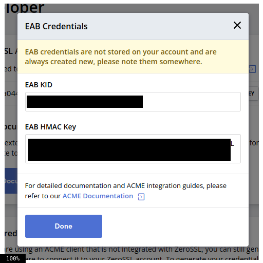
- Sử dụng EAB credentials đã lấy đăng ký với acme.sh:
    ```bash
    acme.sh --register-account -m minh@75606@gmail.com \
  --server zerossl \
  --eab-kid <EAB_KEY> \
  --eab-hmac-key <EAB_HMAC_KEY>
- Tạo chứng chỉ SSL cho 2 domain
    ```bash
    acme.sh --install-cert -d wp.chiennguyen.vietnix.tech \
    --key-file /etc/nginx/ssl/wp.key \
    --fullchain-file /etc/nginx/ssl/wp.crt \
    --reloadcmd "systemctl reload nginx"

    acme.sh --install-cert -d laravel.chiennguyen.vietnix.tech \
    --key-file /etc/nginx/ssl/laravel.key \
    --fullchain-file /etc/nginx/ssl/laravel.crt \
    --reloadcmd "systemctl reload nginx"
    ```
    - lệnh này sễ sinh chứng chỉ cho mỗi domain, lưu key và fullchain vào thư mục `/etc/nginx/ssl`, sau đó reload Nginx để áp dụng.
- Chỉnh sửa site block nginx của wp và laravel:
    ```bash
    server {
    listen 80;
    listen [::]:80;
    server_name wp.chiennguyen.vietnix.tech;
    return 301 https://$host$request_uri;
    }


    server {
    listen 443 ssl;
    listen [::]:443 ssl;
    server_name wp.chiennguyen.vietnix.tech;

   
    ssl_certificate     /etc/nginx/ssl/wp.crt;
    ssl_certificate_key /etc/nginx/ssl/wp.key;
    ...
    ```
    
    ```bash
    server {
    listen 80;
    server_name laravel.chiennguyen.vietnix.tech;
    return 301 https://$host$request_uri;
    }

    server {
    listen 443 ssl;
    server_name laravel.chiennguyen.vietnix.tech;

    ssl_certificate     /etc/nginx/ssl/laravel.crt;
    ssl_certificate_key /etc/nginx/ssl/laravel.key;
    ...
    ```
    - `return 301 https://$host$request_uri;`: Cấu hình Nginx redirect toàn bộ request HTTP sang HTTPS.
    - `listen 443`:  Khai báo lắng nghe trên port 443 (HTTPS)
    - `ssl_certificate`, `ssl_certificate_key`: nạp chứng chỉ SSL và private key cho domain.
- Kiểm tra 
    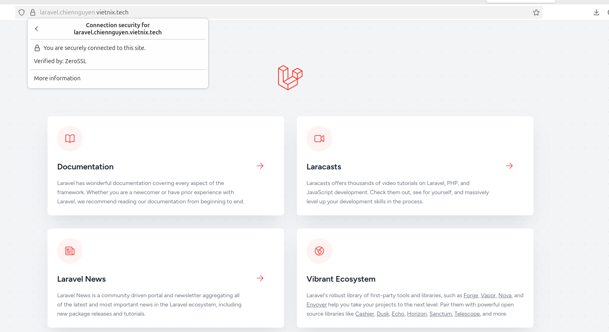
    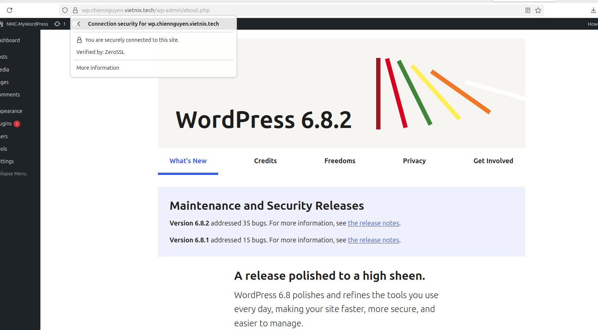
### 4. Tạo tài khoản ftp.
- Cài đặt ftp
    ```bash
    sudo apt install vsftpd -y
    ```
- Tạo user ftp và cho phép user này truy cập thư mục web (Ví dụ: `/var/www/wordpress`)
    ```bash
    sudo adduser chienftp
    sudo usermod -d /var/www/wordpress chienftp
    sudo chown -R chienftp:chienftp /var/www/wordpress
    ```
- Cấu hình ftp
    ```bash
    sudo nano /etc/vsftpd.conf
    ```
    Trong file cấu hình ftp, chỉnh/thêm các dòng sau
    ```bash
    local_enable=YES ## Cho phép local users đăng nhập FTP.
    write_enable=YES ## user mới có thể upload / rename / delete file qua FTP.
    chroot_local_user=YES ## user FTP chỉ được ở trong home directory của mình.
    allow_writeable_chroot=YES ## Dòng này cho phép vừa chroot vừa writable.
    ```
- Kiểm thử
    - Đăng nhập ftp trên máy client:
    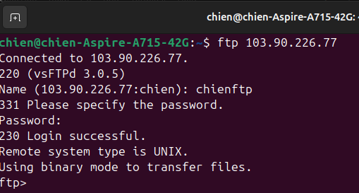

    - Chia sẻ tập tin bằng ftp từ máy client bằng user ftp vừa tạo:
    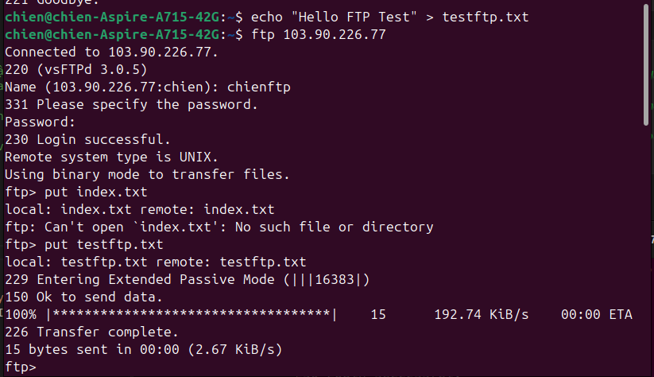

    - Kiểm tra tập tin chia sẻ trên thư mục /var/www/wordpress ở server:
    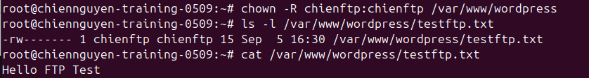
    
### 5. Mysql: mysql (bật remote mysql từ xa với user root)
- Trong file cấu hình SQL `/etc/mysql/mysql.conf.d/mysqld.cnf` chỉnh sửa `bind-address` từ `127.0.0.1` thành `0.0.0.0`. ĐIều này cho phép Cho phép MySQL lắng nghe trên tất cả IP.
- Tạo user root có quyền truy cập từ xa.
    - Đăng nhập vào MySQL:
    ```bash
    mysql -u root -p
    ```
    - Trong MySQL shell, chạy lần lượt các lệnh sau:
        ```bash
        CREATE USER 'root'@'%' IDENTIFIED BY 'your_password';
        GRANT ALL PRIVILEGES ON *.* TO 'root'@'%' WITH GRANT OPTION;
        FLUSH PRIVILEGES;
        ```
        - `%`: Cho phép root login từ mọi địa chỉ IP
        - `ALL PRIVILEGES`: Cấp mọi quyền cho root.
    - Kiểm tra các hosts của user root:
    ```bash
    mysql> SELECT user, host FROM mysql.user WHERE user='root';
    +------+-----------+
    | user | host      |
    +------+-----------+
    | root | %         |
    | root | localhost |
    +------+-----------+
    2 rows in set (0.00 sec)
    ```
    - Đăng nhập mysql (remote) từ máy client để kiểm tra.
    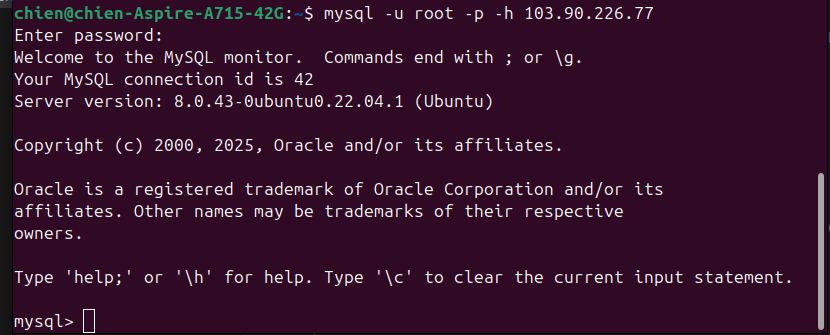


