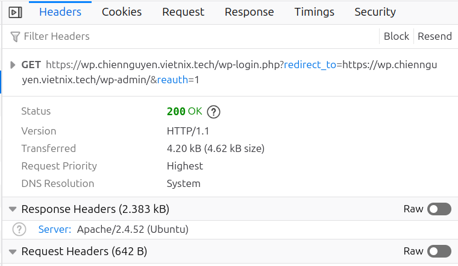

# NGUYỄN MINH CHIẾN - Nội dung 09/09/2025
## I. Reverse Proxy
### Khái niệm
- Reverse Proxy là một hệ thống được đặt trước các nhóm Server, đóng vai trò như người trung gian để phục vụ việc giao tiếp giữa Client và Web Server. Cụ thể, Reverse Proxy sẽ chặn yêu cầu từ Client (như trình duyệt Web), sau đó giao tiếp với Web Server thay cho Client đó.

- Trong các giao tiếp Internet tiêu chuẩn, Client sẽ trực tiếp kết nối với Web Server, chúng gửi yêu cầu và chờ đợi kết quả phản hồi trực tiếp từ Web Server. Nhưng với hệ thống có Reverse Proxy, thì Reverse Proxy sẽ tiếp nhận yêu cầu từ Client, sau đó gửi yêu cầu này đến Web Server. Kết quả phản hồi từ Web Server được gửi trả về lại cho Reverse Proxy, sau đó mới được truyền đến Reverse Proxy.
### Mô hình Reverse Proxy với Nginx và Apache
- Trong mô hình reverse proxy, Nginx đứng trước Apache để nhận tất cả các yêu cầu từ trình duyệt. Nginx đóng vai trò là “cổng vào”, quyết định xem request nào sẽ được phục vụ trực tiếp và request nào cần gửi sang backend Apache.
- Nginx rất mạnh trong việc xử lý file tĩnh như ảnh, CSS, JavaScript hay font. Khi Nginx đứng trước, các file này được trả trực tiếp mà không cần Apache xử lý, giúp giảm tải cho Apache và cải thiện tốc độ phản hồi.
- Các request yêu cầu thực thi PHP hoặc logic động sẽ được Nginx proxy sang Apache. Apache chỉ tập trung vào việc xử lý nội dung động, database và tạo HTML, giúp backend hoạt động hiệu quả hơn.
- Ngoài việc phân chia tĩnh – động, Nginx còn hỗ trợ nén dữ liệu, cache, cân bằng tải và lọc request độc hại trước khi đến Apache. Điều này giúp hệ thống ổn định, bảo mật và dễ mở rộng khi lượng truy cập tăng.
### Cài đặt Apache
- Để cài đặt Apache, sử dụng các lệnh sau:
```bash
sudo apt update
sudo apt install apache2
sudo systemctl enable --now apache2
```
- Sau khi cài đặt, vì mặc định Apache sử dụng port 80 tương tự như N Nginx nên khi khởi động sẽ bị lỗi do Nginx đã chiếm dụng tiến trình. Vì vậy phải đổi port của Apache sang port khác (ví dụ 8080). Truy cập file cấu hình `/etc/apache2/ports.conf` để thay đổi:
```bash
Listen 8080
```
- Sau đó reload lại Apache và kiểm tra bằng truy cập lên trình duyệt hoặc status:
```bash
sudo systemctl restart apache2
sudo systemctl status apache2
```


## II. Xây dựng website với hệ thống Reverse Proxy Đối 
- Cấu hình `/etc/apache2/ports.conf` để APache chỉ lắng nghe các port của các website cấu hình trong vhost:
    ```bash
    Listen 8080 # port của Wordpress
    Listen 8081 # port của Laravel
    Listen 8090 # port của Default vhost (dùng cho câu sau)
    Listen 8443 # port SSL của Wordpress
    Listen 8444 # port SSL của Laravel
    Listen 8493 # port SSL của Default host
    ```
- Cấu hình SSL chung cho tất cả các vhost Apache Backend. Vì Nginx sẽ forward nội bộ qua Apache (localhost) nên ta sử dụng SSL tự ký để dễ quản lý. 
    ```bash
    openssl req -x509 -nodes -days 365 \
    -newkey rsa:2048 \
    -keyout /etc/apache2/ssl/defaultapache.key \
    -out /etc/apache2/ssl/defaultkey.crt \
    -subj "/CN=default.local" \
    -addext "subjectAltName=DNS:default.local,IP:127.0.0.1"
    ```
    - `CN = default.local`: hostname mà certificate đại diện. Khi Nginx proxy truy cập default.local, sẽ khớp với CN để verify SSL. Hostname này được cấu hình để phân giải sang IP `127.0.0.1` trong `/etc/hosts/` để Nginx hoặc hệ thống biết rằng `default.local` trỏ tới `localhost`, đảm bảo kết nối end-to-end SSL nội bộ giữa Nginx và Apache hoạt động mà không gặp lỗi hostname mismatch.
    - `-addext "subjectAltName=DNS:default.local,IP:127.0.0.1"`: thêm Subject Alternative Name (SAN) vào certificate. Cho phép cert hợp lệ khi truy cập khi truy cập vào ip hoặc hostname cấu hình.
### Trường hợp 1: Nginx proxy hết tất cả request từ client để Apache backend xử lí
Trong trường hợp này, mọi yêu cầu từ client, bao gồm cả file tĩnh (ảnh, CSS, JavaScript…) và file động (PHP), đều được Nginx chuyển tiếp (proxy) đến Apache để xử lý. Nginx ở đây đóng vai trò reverse proxy, chỉ nhận request từ client và chuyển tiếp, sau đó trả kết quả từ Apache về client mà không xử lý nội dung trực tiếp. Apache sẽ chịu trách nhiệm xử lý toàn bộ các yêu cầu: đọc file tĩnh, thực thi PHP, truy vấn cơ sở dữ liệu và tạo ra HTML hoặc các nội dung khác.

Cách triển khai này đơn giản nhưng không tận dụng được khả năng phục vụ file tĩnh nhanh của Nginx, do đó hiệu suất tổng thể sẽ thấp.
#### WordPress
##### Cấu hình Apache
- Tạo 2 Virtual Host chứa website Wordpress tại thư mục `/etc/apache2/sites-available/wordpress.conf`cho hai kết nối HTTP và HTTPS:
    ```bash
    <VirtualHost 127.0.0.1:8080>
        ServerName wp.chiennguyen.vietnix.tech
        DocumentRoot /var/www/wordpress
        <Directory /var/www/wordpress>
            AllowOverride All
            Require all granted
        </Directory>
    </VirtualHost>
    ```

    ```bash
    <VirtualHost 127.0.0.1:8443>
        ServerName wp.chiennguyen.vietnix.tech
        DocumentRoot /var/www/wordpress

        SSLEngine on
        SSLCertificateFile /etc/apache2/ssl/defaultkey.crt
        SSLCertificateKeyFile /etc/apache2/ssl/defaultapache.key

        <Directory /var/www/wordpress>
            AllowOverride All
            Require all granted
        </Directory>
    </VirtualHost>
    ```

    - `VirtualHost`: Máy chủ ảo lắng nghe dựa trên địa chỉ IP và port được cấu hình. Ở đây IP được cấu hình là `127.0.0.1` (localhost) để  Apache chỉ nhận request từ chính máy chủ, nghĩa là chỉ có Nginx hoặc các ứng dụng nội bộ mới có thể truy cập giúp tăng bảo mật và phù hợp với mô hình reverse proxy. Nginx sẽ nhận request từ client và chuyển tiếp tới Apache trên localhost.
    - `ServerName`: Khai báo tên miền hoặc IP để Apache nhận diện (website này sẽ phục vụ khi người dùng truy cập domain/IP này).
    - `DocumentRoot`: Thư mục gốc chứa mã nguồn website WordPress.
    - `<Directory>` Quy định quyền và cách xử lý cho thư mục:
        - `AllowOverride All`: Cho phép sử dụng file `.htaccess` để ghi đè cấu hình.
        - `Require all granted`: Cho phép truy cập vào tất cả thư mục.
    - `SSLEngine`: Bật SSL
    - `SSLCertificateFile` và `SSLCertificateKeyFile`: đường dẫn tới file chứng chỉ công khai (.crt) của site và private key tương ứng (.key).
- Sau khi cấu hình, kích hoạt vhost và kiểm tra syntax, sau đó khởi động lại apache2
    ```bash
        sudo a2ensite wordpress.conf
        sudo apache2ctl configtest
        sudo systemctl reload apache2
    ```
- Cấu hình `.htaccess` trong `/var/www/wordpresss/`. `.htaccess` dùng để cấu hình Apache tại thư mục web mà không cần sửa file chính, ở đây sử dụng `mod_rewrite`, chủ yếu để URL thân thiện và hỗ trợ HTTPS qua reverse proxy.
    ```bash
    # BEGIN WordPress
    <IfModule mod_rewrite.c>
    RewriteEngine On
    RewriteRule .* - [E=HTTP_AUTHORIZATION:%{HTTP:Authorization}]
    RewriteBase /
    RewriteRule ^index\.php$ - [L]
    RewriteCond %{REQUEST_FILENAME} !-f
    RewriteCond %{REQUEST_FILENAME} !-d
    RewriteRule . /index.php [L]
    </IfModule>
    SetEnvIf X-Forwarded-Proto "https" HTTPS=on
    # END WordPress
    ```
    - `<IfModule>:` Chỉ chạy các rule rewrite nếu module mod_rewrite bật.
    - `RewriteEngine On`: Bật rewrite.
    - `RewriteRule .*`: Giữ header Authorization.
    - `RewriteBase /`:Thư mục gốc cho rewrite.
    - `RewriteRule ^index\.php$ - [L]`: Không rewrite index.php.
    - `RewriteCond %{REQUEST_FILENAME} !-f và !-d`: Điều kiện file/thư mục không tồn tại.
    - `RewriteRule . /index.php [L]`:Gửi tất cả request về index.php.
    - `SetEnvIf X-Forwarded-Proto "https" HTTPS=on`: Khi dùng Nginx reverse proxy, báo cho Apache biết site đang dùng HTTPS.

##### Cấu hình Nginx
- Cấu hình Nginx làm reverse proxy cho website WordPress chạy trên Apache backend. cấu hình 2 block server qua file `/etc/nginx/sites-available/wp.chiennguyen.vietnix.tech` riêng biệt cho truy cập HTTP và HTTPS theo yêu cầu đề bài (Không cấu hình redirect từ HTTP -> HTTPS).
    ```bash
        server {
            listen 80;
            server_name wp.chiennguyen.vietnix.tech;

            location / {
                proxy_pass http://127.0.0.1:8080;  # Apache backend chạy HTTP
                proxy_set_header Host $host;
                proxy_set_header X-Real-IP $remote_addr;
                proxy_set_header X-Forwarded-For $proxy_add_x_forwarded_for;
                proxy_set_header X-Forwarded-Proto $scheme;
            }
        }

    ```
    - `listen 80`: lắng nghe HTTP.
    - `server_name`: Domain của website.
    - `proxy_pass`: gửi tất cả request tới Apache Backend tại 127.0.0.1:8080.
    - `proxy_set_header Host $host`: giữ nguyên header Host, để - WordPress biết domain đúng.
    - `X-Real-IP & X-Forwarded-For`: gửi IP client gốc tới Apache (không bị mất IP khi qua proxy).
    - `X-Forwarded-Proto`: gửi scheme (http hoặc https) tới Apache, để WordPress nhận biết HTTPS đúng khi cần.

    ```bash
    server {
        listen 443 ssl;
        server_name wp.chiennguyen.vietnix.tech;

        ssl_certificate     /etc/nginx/ssl/wp.crt;
        ssl_certificate_key /etc/nginx/ssl/wp.key;

        add_header Content-Security-Policy "upgrade-insecure-requests" always;

        location / {
            proxy_pass https://default.local:8443;  # Apache backend sử dụng HTTPS
            proxy_set_header Host $host;
            proxy_set_header X-Real-IP $remote_addr;
            proxy_set_header X-Forwarded-For $proxy_add_x_forwarded_for;
            proxy_set_header X-Forwarded-Proto $scheme;
            proxy_ssl_verify on;
            proxy_ssl_trusted_certificate /etc/apache2/ssl/defaultkey.crt;
            proxy_ssl_verify_depth 1;
        }
    }
    ```
    - `listen 443 ssl`: lắng nghe HTTPS.
    - `https://default.local:8443`: gửi tất cả request tới Apache Backend tại default.local:8443. 
    - `ssl_certificate` và `ssl_certificate_key:`: đường dẫn tới file chứng chỉ công khai (.crt) của site và private key tương ứng (.key). Khi client đăng nhập vào nginx sẽ xác thực bằng SSL này.
    - `add_header Content-Security-Policy - "upgrade-insecure-requests"`: chỉ thị trình duyệt tự động nâng request HTTP sang HTTPS, tránh mixed content (một số file tải bằng HTTP trên site HTTPS làm lỗi hiển thị).
    - `proxy_set_header`: Giữ thông tin gốc của client bao gồm hostname, ip, protocol khi request đi qua proxy.  Giúp backend biết request từ client là gì, tránh mất thông tin khi proxy chuyển tiếp.
    - `proxy_ssl_verify on`: Bắt buộc Nginx xác thực SSL Apache trước khi forward request từ client.
    - `proxy_ssl_trusted_certificate`: đường đẫn tới file được Nginx dùng để  xác thực Apache Backend. Do chứng chỉ SSL của Apache là self-signed, Nginx cần file này để tin tưởng SSL.
    - `proxy_ssl_verify_depth 1`: giới hạn xác thực SSL ở mức 1, chỉ xác thực chứng chỉ, không xác thực CA.

- Sau khi cấu hình, kiểm tra và restart lại Nginx để áp dụng.
    ```bash
    sudo nginx -t
    sudo systemctl restart nginx
    ```
##### Kiểm thử website wordpress.
- Truy cập web qua HTTP:
    

- Truy cập web qua HTTPS:
    

- Kiểm tra xem Nginx Reverse Proxy có hoạt động đúng không bằng cách tạm thời dừng Apache backend và truy cập lại trang web.
    ```bash
    sudo systemctl stop apache2
    ```
    

    Kết quả trên hình cho thấy:
    - Nginx đang chạy và nhận request từ trình duyệt.
    - Nginx cố gắng gửi request tới backend (Apache) nhưng không kết nối được. Vì Apache đang dừng, nên Nginx trả lỗi 502 Bad Gateway.
    - Điều này chứng tỏ Nginx đang nhận request nhưng không thể forward tới Apache, nghĩa là proxy_pass đang hoạt động.
#### Laravel
Cấu hình website Laravel về căn bản cũng tương tự như cấu hình WordPress.
##### Cấu hình Apache
- Tạo Virtual Host chứa website Laravel tại thư mục `/etc/apache2/sites-available/laravel.conf`
    ```bash
    <VirtualHost 127.0.0.1:8081>
        ServerName laravel.chiennguyen.vietnix.tech
        DocumentRoot /var/www/laravel/public
        <Directory /var/www/laravel/public>
            AllowOverride All
            Require all granted
        </Directory>
    </VirtualHost>
    ```

    ```bash
    <VirtualHost 127.0.0.1:8444>
        ServerName laravel.chiennguyen.vietnix.tech
        DocumentRoot /var/www/laravel/public

        SSLEngine on
        SSLCertificateFile /etc/apache2/ssl/defaultkey.crt
        SSLCertificateKeyFile /etc/apache2/ssl/defaultapache.key

        <Directory /var/www/laravel/public>
            AllowOverride All
            Require all granted
        </Directory>
    </VirtualHost>
    ```
- Sau khi cấu hình, kích hoạt vhost và kiểm tra syntax, sau đó khởi động lại apache2
    ```bash
        sudo a2ensite laravel.conf
        sudo apache2ctl configtest
        sudo systemctl reload apache2
    ```
##### Cấu hình Nginx
- Cấu hình Nginx làm reverse proxy cho website Laravel chạy trên Apache backend. cấu hình 2 block server qua file `/etc/nginx/sites-available/laravel.chiennguyen.vietnix.tech` riêng biệt cho truy cập HTTP và HTTPS theo yêu cầu đề bài (Không cấu hình redirect từ HTTP -> HTTPS).
    ```bash
    server {
        listen 80;
        server_name laravel.chiennguyen.vietnix.tech;

        location / {
            proxy_pass http://127.0.0.1:8081;
            proxy_set_header Host $host;
            proxy_set_header X-Real-IP $remote_addr;
            proxy_set_header X-Forwarded-For $proxy_add_x_forwarded_for;
            proxy_set_header X-Forwarded-Proto $scheme;
        }
    }

    server {
        listen 443 ssl;
        server_name laravel.chiennguyen.vietnix.tech;

        ssl_certificate     /etc/nginx/ssl/laravel.crt;
        ssl_certificate_key /etc/nginx/ssl/laravel.key;

        root /var/www/laravel/public;
        index index.php index.html;

        add_header X-Frame-Options "SAMEORIGIN";
        add_header X-Content-Type-Options "nosniff";

        location / {
            proxy_pass https://default.local:8444;
            proxy_set_header Host $host;
            proxy_set_header X-Real-IP $remote_addr;
            proxy_set_header X-Forwarded-For $proxy_add_x_forwarded_for;
            proxy_set_header X-Forwarded-Proto $scheme;
            proxy_ssl_verify on;
            proxy_ssl_trusted_certificate /etc/apache2/ssl/defaultkey.crt;
            proxy_ssl_verify_depth 1;
        }
    }
    ```
- Sau khi cấu hình, kiểm tra và restart lại Nginx để áp dụng.
    ```bash
    sudo nginx -t
    sudo systemctl restart nginx
    ```
##### Kiểm thử website Laravel.
- Truy cập web qua HTTP:

- Truy cập web qua HTTPS:

- Kiểm tra xem Nginx Reverse Proxy có hoạt động đúng không bằng cách tạm thời dừng Apache backend và truy cập lại trang web.
    ```bash
    sudo systemctl stop apache2
    ```
    

### Trường hợp 2: Nginx xử  lí các yêu cầu nội dung tĩnh (.img,.css,.js,...) còn Apache cấu hình xử lí các yêu cầu nội dung động (.php).
Trong trường hợp này, Nginx sẽ đảm nhận vai trò xử lý tất cả các yêu cầu đến file tĩnh như hình ảnh (.jpg, .png, .gif), CSS (.css), JavaScript (.js) và các định dạng font hoặc video. Điều này giúp giảm tải cho backend, vì các file tĩnh có thể được Nginx trả trực tiếp mà không cần gọi Apache.

Ngược lại, Apache sẽ được cấu hình để xử lý các yêu cầu file động, chủ yếu là các file PHP. Khi client gửi request tới một file PHP, Nginx sẽ proxy request đó tới Apache, nơi PHP sẽ được thực thi, database được truy vấn và kết quả HTML động được trả về.

#### Cấu hình Nginx ví dụ cho Wordpress (đối với Laravel cũng tương tự)
- Tại thư mục `/etc/nginx/sites-available/wp.chiennguyen.vietnix.tech` thêm cấu hình sau. (dưới đây là cấu hình cho vhost HTTPS, đối với vhost HTTP cấu hình tương tự):
    ```bash
    server {
        listen 443 ssl;
        server_name wp.chiennguyen.vietnix.tech;

        ssl_certificate     /etc/nginx/ssl/wp.crt;
        ssl_certificate_key /etc/nginx/ssl/wp.key;

        add_header Content-Security-Policy "upgrade-insecure-requests" always;

        ## đoạn cần thêm
        root /var/www/wordpress;

        location ~* \.(jpg|jpeg|png|gif|css|js|ico|woff|woff2|ttf|svg|eot|mp4|webp)$ {
            try_files $uri =404;
            access_log off;
            expires max;
        }
        ## đoạn cần thêm
    
        location / {
            proxy_pass https://default.local:8443; 
            proxy_set_header Host $host;
            proxy_set_header X-Real-IP $remote_addr;
            proxy_set_header X-Forwarded-For $proxy_add_x_forwarded_for;
            proxy_set_header X-Forwarded-Proto $scheme;
            proxy_ssl_verify on;
            proxy_ssl_trusted_certificate /etc/apache2/ssl/defaultkey.crt;
            proxy_ssl_verify_depth 1;
            proxy_pass_header Server; ## Dòng cần thêm
        }
    }

    ```
    giải thích:
    - `root /var/www/wordpress`: Cấu hình chỉ thư mục để Nginx lấy file tĩnh
    - `location ~* \.`: Cấu hình danh sách các loại file tĩnh mà nginx xử lí. Tất cả các request kết thúc bằng các đuôi file tĩnh này, bất kể viết hoa hay thường, sẽ được xử lý trong block của Nginx, không forward sang cho Apache.
    - `try_files $uri =404`: Nếu các file tĩnh này không tồn tại, lập tức trả về status 404, không forward sang Apache.
    - `access_log off`: Tắt log truy cập cho các file tĩnh.
    - `expires max`: Nginx gửi header Expires hoặc Cache-Control cho trình duyệt để file này có thể cache lâu nhất có thể.
    - `proxy_pass_header Server`: Cho phép Nginx truyền header Server từ backend (Apache) về client khi proxy request. Phục vụ cho việc xác định server xử lí các file là server Apache hay Nginx.
    
#### Kiểm thử 
Truy cập vào Wordpress và Laravel, bật F12 để kiểm tra một số file tài nguyên.
- File động xử lí bởi Apache.


- File tĩnh xử lí bởi Nginx.


## III. Xây dựng Default vhost cho mọi domain và IP còn lại
### Cấu hình Apache
- Tạo Virtual Host chứa website default tại thư mục `/etc/apache2/sites-available/default.conf`
    ```bash
    <VirtualHost 127.0.0.1:8090>
        ServerName default
        DocumentRoot /var/www/test

        <Directory /var/www/test>
            AllowOverride All
            Require all granted
        DirectoryIndex test.html
        </Directory>

        ErrorLog ${APACHE_LOG_DIR}/default-error.log
        CustomLog ${APACHE_LOG_DIR}/default-access.log combined
    </VirtualHost>
    ```
    ```bash
     <VirtualHost 127.0.0.1:8493>
        ServerName _default_
        DocumentRoot /var/www/test
        SSLEngine on
        SSLCertificateFile /etc/apache2/ssl/defaultkey.crt
        SSLCertificateKeyFile /etc/apache2/ssl/defaultapache.key

        <Directory /var/www/laravel/test>
            AllowOverride All
            Require all granted
        DirectoryIndex test.html
        </Directory>
    </VirtualHost>
    ```
    - `<VirtualHost 127.0.0.1:8090>`: Cấu hình máy chủ ảo Apache lắng nghe trên IP 127.0.0.1 và port 8090.
    - `ServerName default`: Đặt tên server là "default" (dùng khi hostname không khớp VirtualHost khác).
    - `DocumentRoot /var/www/test`: Thư mục gốc chứa file web của VirtualHost này.
    - `AllowOverride All`: Cho phép .htaccess ghi đè cấu hình Apache trong thư mục này.
    - `Require all granted`: Cho phép mọi client truy cập thư mục này.
    - `DirectoryIndex test.html`: File mặc định khi truy cập thư mục là test.html. Đây là một file html mẫu để biểu thị truy cập.
    - `ErrorLog ${APACHE_LOG_DIR}/default-error.log`: Đường dẫn file log lỗi của VirtualHost.
    - `CustomLog ${APACHE_LOG_DIR}/default-access.log combined`: Đường dẫn file log truy cập, dùng định dạng combined.

    - Sau khi cấu hình, kích hoạt vhost và kiểm tra syntax, sau đó khởi động lại apache2
    ```bash
        sudo a2ensite default.conf
        sudo apache2ctl configtest
        sudo systemctl reload apache2
    ```
### Cấu hình Nginx
- Trước khi cấu hình, ta phải vô hiệu hóa site default của Nginx để khi người dùng truy cập bằng IP hoặc domain chưa cấu hình, request không chạy site mặc định của Nginx mà sẽ được forward tới Apache VirtualHost đã cấu hình ở trên. Để làm điều đó ta hủy symlink site mặc định của Nginx:

```bash
sudo unlink /etc/nginx/sites-enabled/default
```
- Cấu hình Nginx làm reverse proxy cho website default trên Apache Backend. Cấu hình các block server qua file `/etc/nginx/sites-available/defaultproxy` riêng biệt cho truy cập HTTP và HTTPS theo yêu cầu đề bài (Không cấu hình redirect từ HTTP -> HTTPS).
    ```bash
    server {
        listen 80 default_server;
        server_name _;

        location / {
            proxy_pass http://127.0.0.1:8090;
            proxy_set_header Host $host;
            proxy_set_header X-Real-IP $remote_addr;
            proxy_set_header X-Forwarded-For $proxy_add_x_forwarded_for;
            proxy_set_header X-Forwarded-Proto $scheme;
        }
    }
    ```
    - `Listen 80 default_server`: Lắng nghe port 80 và đặt là default server (nếu request không khớp server_name nào khác)
    - `server_name _`: Dùng "_" làm wildcard, khớp tất cả các domain chưa được cấu hình và khớp với virtual host đằng sau.
    ```bash
    # HTTPS
    server {
        listen 443 ssl default_server;
        server_name _;

        ssl_certificate     /etc/nginx/ssl/nginx.crt;
        ssl_certificate_key /etc/nginx/ssl/nginx.key;

        location / {
            proxy_pass https://default.local:8493;
            proxy_set_header Host $host;
            proxy_set_header X-Real-IP $remote_addr;
            proxy_set_header X-Forwarded-For $proxy_add_x_forwarded_for;
            proxy_set_header X-Forwarded-Proto $scheme;
            proxy_ssl_verify on;
            proxy_ssl_trusted_certificate /etc/apache2/ssl/defaultkey.crt;
            proxy_ssl_verify_depth 1;
        }
    }
    ```
    - `ssl_certificate` và `ssl_certificate_key:`: đường dẫn tới file chứng chỉ công khai (.crt) của site và private key tương ứng (.key). Ở đây thay vì sử dụng SSL của nhà cung cấp thì ta sẽ tự tạo 1 SSL tự cấp cho tất cả domain khác và IP.
- Sau khi cấu hình, tạo một file symlink vào thư mục `/etc/nginx/site-enabled/` rồi kiểm tra syntax và khởi động lại nginx để lưu cấu hình.
    ```bash
    sudo ln -s /etc/nginx/sites-available/defaultproxy /etc/nginx/sites-enabled/
    sudo nginx -t
    sudo systemctl restart nginx
    ```
### Kiểm thử
- Truy cập website qua HTTP bằng địa chỉ IP

- Truy cập website qua HTTPS bằng địa chỉ IP

- Truy cập website qua HTTP bằng một domain khác đã cấu hình phân giải về địa chỉ IP

    -> Do SSL được cấu hình là SSL tự cấp, không phải SSL chính chủ nên trang web dù truy cập bằng HTTPS sẽ cảnh báo `connection not secure`