# NGUYỄN MINH CHIẾN - NỘI DUNG TÌM HIỂU 12/09/2025
## I. cPanels
### Khái niệm
cPanel là một hệ thống quản trị web hosting mạnh mẽ, được xây dựng trên nền tảng Linux, cung cấp giao diện đồ họa trực quan và dễ sử dụng. Giao diện này được thiết kế đơn giản, linh hoạt, cho phép người dùng dễ dàng quản lý mọi khía cạnh của website và hosting.

cPanel hoạt động dựa trên một hệ thống phân cấp ba lớp: Nhà cung cấp dịch vụ hosting (Hosting Company), Đại lý bán lại (Reseller) và Người dùng cuối (End User). Cả Hosting Company và Reseller đều sử dụng giao diện Web Host Manager (WHM) để quản lý máy chủ, trong khi End User tương tác trực tiếp với giao diện cPanel. WHM cấp cho Hosting Company quyền quản trị cao nhất, đồng thời cho phép họ tùy chỉnh quyền truy cập của Reseller đối với các tính năng nhất định.

### Các chức năng chính của cPanels
#### 1. Quản lí tập tin
- Truy cập, tạo, chỉnh sửa, xóa file (File Manager).
- Giám sát dung lượng (Disk Usage).
- Sao lưu và khôi phục dữ liệu (Backup/Backup Wizard, JetBackup).
- Quản lý hình ảnh (Images).
- Quản lý không gian lưu trữ như máy tính cá nhân (Web Disk).
- Bảo vệ thư mục bằng mật khẩu (Directory Privacy).
- Quản lý tài khoản FTP (FTP Accounts).
- Hỗ trợ Git, File/Directory Restoration.
#### 2. Quản lí cơ sở dữ liệu
- Quản lý MySQL trực quan (phpMyAdmin).
- Truy cập cơ sở dữ liệu từ xa (Remote Database Access).
- Tạo, chỉnh sửa, quản lý DB và user (Manage My Databases, Database Wizard).
#### 3. Quản lý tên miền
- Tạo website tạm (Site Publisher).
- Chuyển hướng URL (Redirects).
- Quản lý DNS (Zone Editor, Dynamic DNS).
- Tạo subdomain, addon, alias.
- Quản lý WordPress (WP Toolkit).
- Trình tạo website kéo-thả (Sitejet Builder).
#### 4. Quản lý email
- Tạo và quản lý tài khoản email (Email Accounts).
- Trả lời tự động (Autoresponders).
- Chuyển tiếp, bộ lọc, định tuyến email (Forwarders, Email Filters, Email Routing).
- Theo dõi dung lượng và tình trạng gửi nhận email (Email Disk Usage, Track Delivery, Email Deliverability).
- Bảo mật email (Encryption, Spam Filters, BoxTrapper).
- Quản lý lịch và danh bạ (Calendars and Contacts).
#### 5. Thống kê số liệu và phân tích
- Theo dõi khách truy cập, băng thông, lỗi (Visitors, Bandwidth, Errors, Raw Access).
- Phân tích và báo cáo truy cập (Webalizer, Analog Stats, Metrics Editor).
- Giám sát tài nguyên và chất lượng website (Resource Usage, Site Quality Monitoring).
#### 6. Tính năng bảo mật
- Truy cập an toàn qua SSH (SSH Access).
- Chặn IP, bảo vệ hotlink, ModSecurity (IP Blocker, Hotlink Protection, ModSecurity Domain Manager).
- Xác thực hai yếu tố (Two-Factor Authentication).
- Quản lý SSL/TLS và chính sách bảo mật (SSL/TLS, Security Policy, SSL/TLS Status).
#### 7. Ứng dụng và phần mềm
- Cài đặt và quản lý WordPress (WordPress Manager by Softaculous).
- Cài đặt ứng dụng web phổ biến (Site Software, Softaculous Apps Installer).
- Quản lý PHP và Node.js (MultiPHP Manager, Setup Node.js App, Select PHP Version).
- Tối ưu hiệu suất website (Optimize Website, X-Ray App, LSCache Manager).
#### 8. Cài đặt nâng cao
- Lập lịch tác vụ tự động (Cron Jobs).
- Quản lý DNS, trang lỗi, chỉ mục (Track DNS, Error Pages, Indexes).
Truy cập dòng lệnh trực tiếp (Terminal).
- Quản lý MIME Types.
#### 9. Tùy chọn người dùng
- Quản lý mật khẩu và bảo mật (Password & Security).
- Quản lý quyền người dùng (User Manager).
- Thông tin liên hệ và ngôn ngữ (Contact Information, Change Language).
#### 10. Softaculous Apps Installer
- Cài đặt nhanh nhiều ứng dụng web, bao gồm CMS, thương mại điện tử, forum, blog,…

## II. Chuyển đổi Source-Code từ VPS lên cPanels
#### Wordpress
- Đăng nhập vào cPanels bằng tài khoàn được cấp:
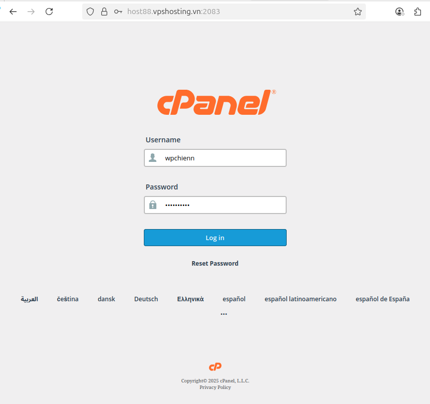
- Truy cập vào file Manager:
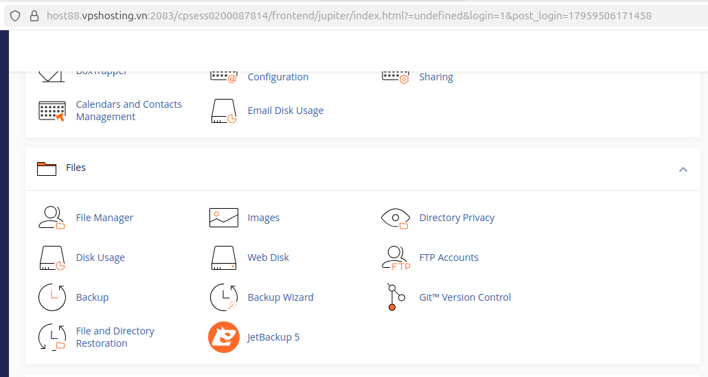
- Tạo thư mục chưa Source-code Wordpresss:
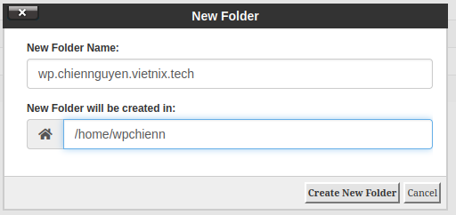
- Nén source code Wordpress ở VPS, sau đó gửi que cPanels bằng FTP. Sau khi upload chuyển đổi thư mục chứa source code sao cho khớp với DocumentRoot của Domain Cpanels
```bash
tar -czvf srupload_wp.tar.gz /var/www/wordpress/source_wp
```
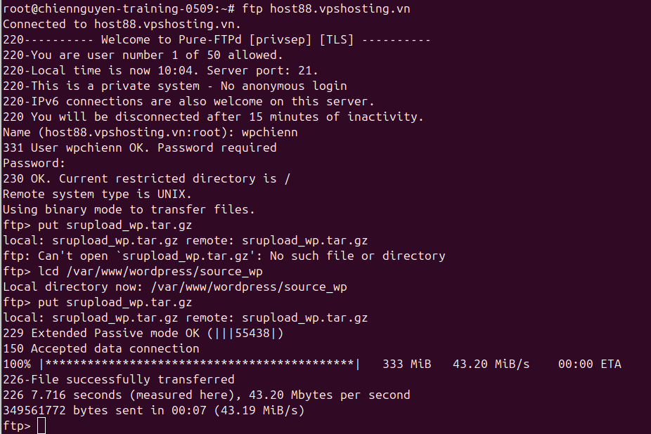

- Tạo file .sql và upload cơ sở dữ liệu lên cPanels.
```bash
mysqldump -u root -p linhlt_db > wp_chien.sql
```
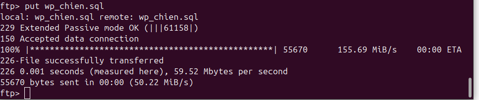
- Tao database trên phpmyadmin (bao gồm databases, user, thêm user vào database và cấu hình quyền truy cập của user). Sau đó import cơ sở dữ liệu bằng phpmyadmin của cPanels.
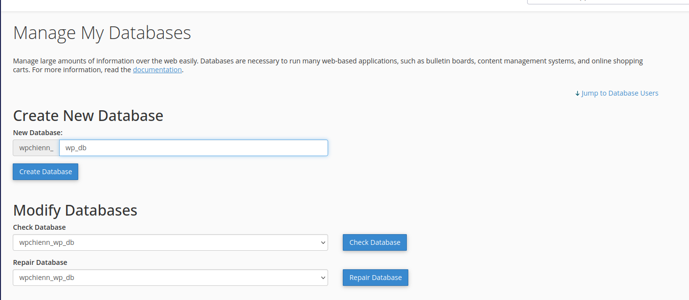
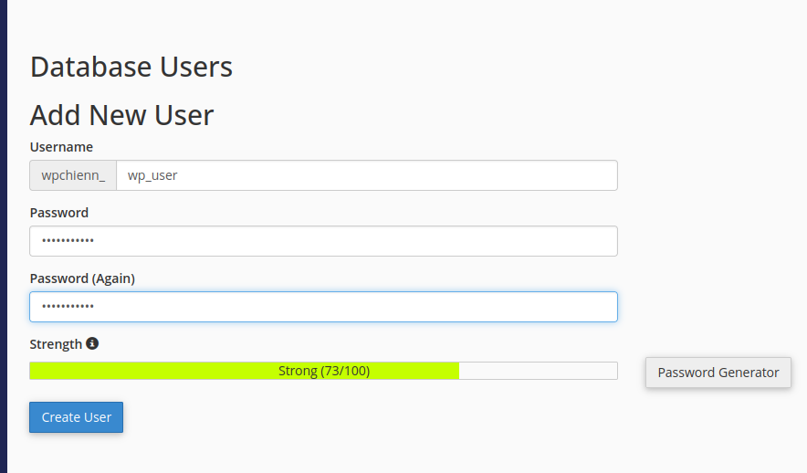
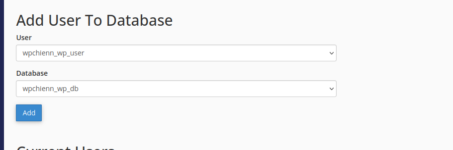
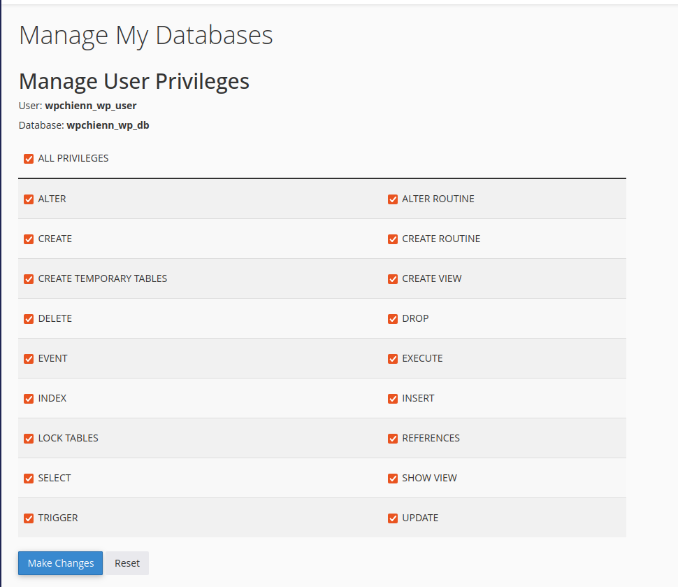
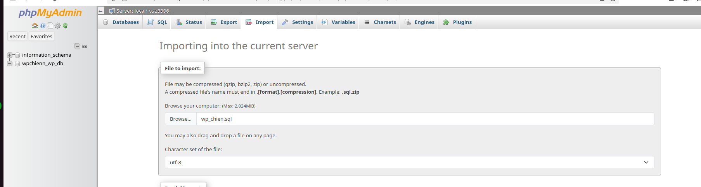
- Truy cập wp-config.php để thay đổi các thông tin phù hợp với thông tin user và database vừa tạo
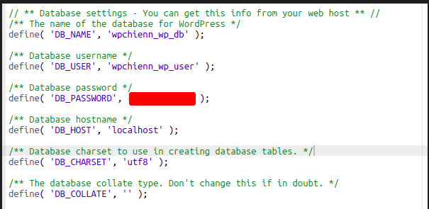
- Tạo file .htaccess trên file cấu hình của Wordpress.

    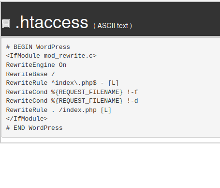
- Gắn SSL cho Wordpress với SSL từ ZeroSSL:
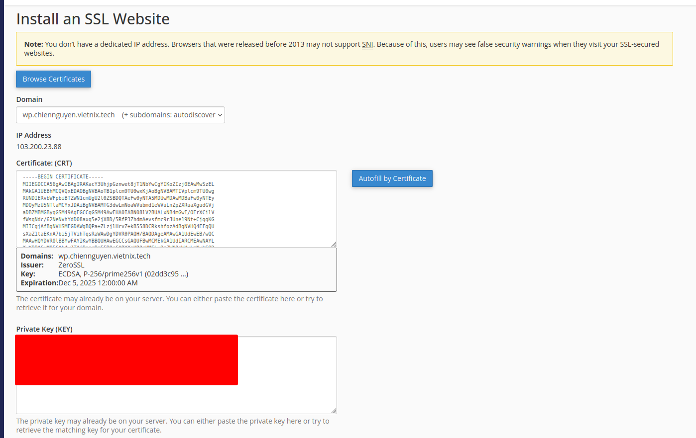
#### Laravel
- Đối với Laravel, các cấu hình cũng tương tự như Wordpress, nhưng có một số điểm cần lưu ý:

    - Cấu hình Domain và DocumentRoot: Do ở Wordpress đã mặc định Primary Domain là wp.chiennguyen.vietnix.tech nên không cần phải cấu hình Domain. Ở laravel ta phải cấu hình một domain riêng biệt và trỏ DocumentRoot tương ứng.
    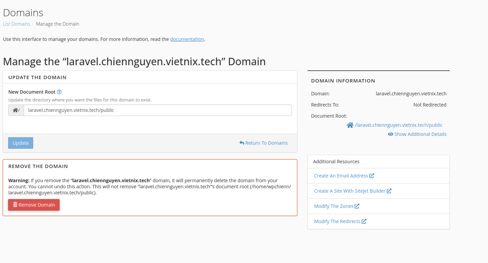

    - Ở laravel sẽ cấu hình thông tin database file .env tương tự như wp-config.php.
    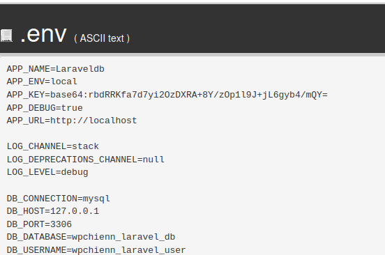

    - Trước khi truy cập website phải xóa các file config ở storage/logs và bootstrap/cache để tránh laravel load lại cấu hình ở thư mục cũ gây lỗi 500 do không tìm thấy thư mục cấu hình.
#### Kiểm thử
- Do các domain vẫn phân giải về địa chỉ IP của VPS nên để kiểm thử, ta 
cấu hình `etc/hosts` ở máy nội bộ để ép domain phân giải về địa chỉ IP của cPanels.
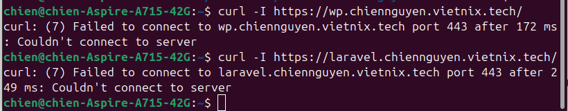
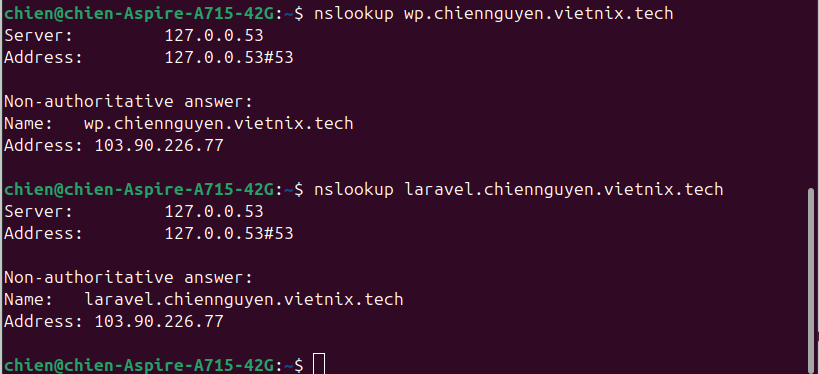
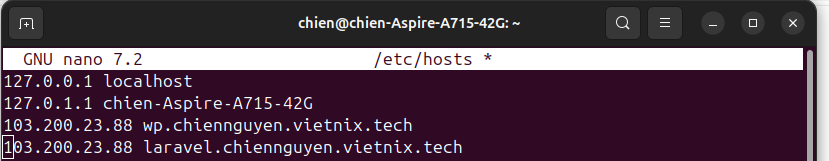

- Truy cập hai website, kiểm tra Header Server sẽ thấy webserver đang chạy là LiteSpeed của cPanels.
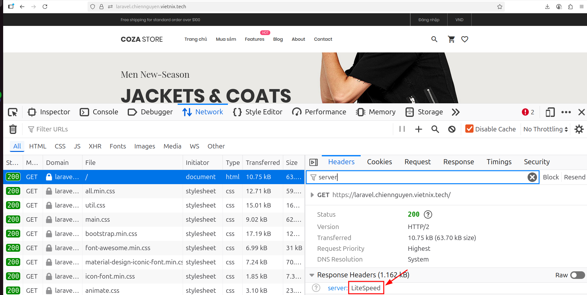
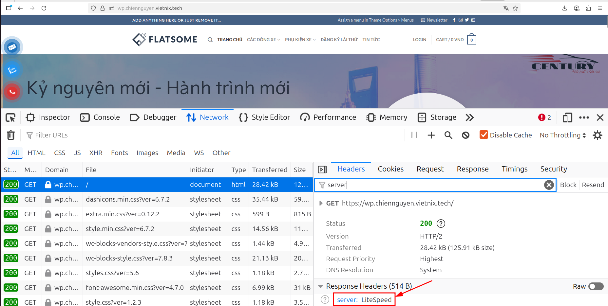