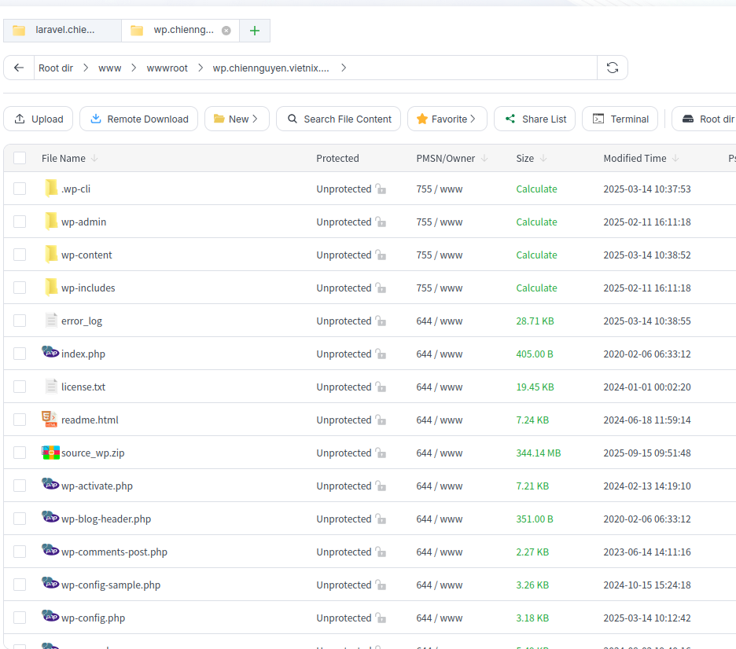
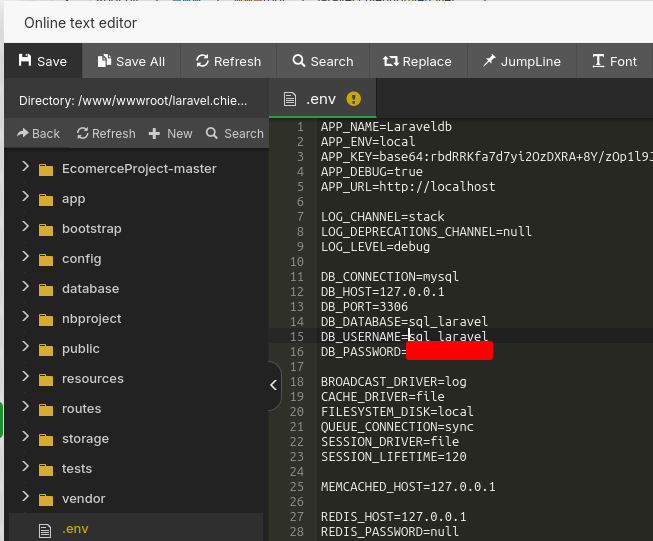
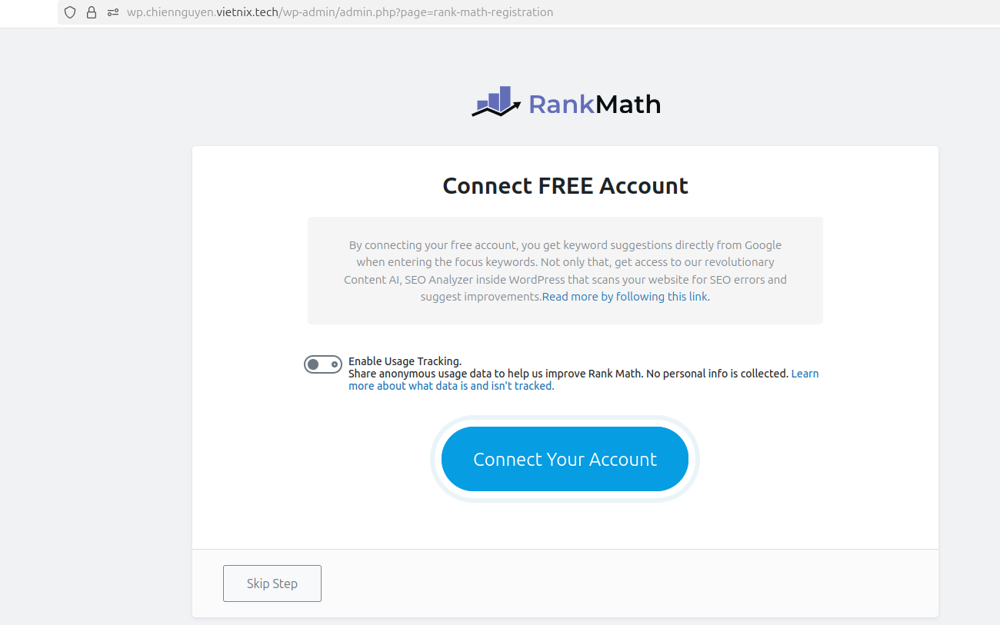

# NGUYỄN MINH CHIẾN - NỘI DUNG TÌM HIỂU 15/09/2025
## aaPanel
### Khái niệm

aaPanel là một bảng điều khiển (control panel) miễn phí và mã nguồn mở, được phát triển bởi BT.cn, một công ty công nghệ Trung Quốc. Đây là phiên bản quốc tế hóa của BAOTA Panel, một trong những giao diện quản lý web hosting phổ biến nhất tại Trung Quốc.

aaPanel giúp đơn giản hóa quá trình quản lý máy chủ Linux thông qua giao diện web trực quan. Người dùng có thể dễ dàng cài đặt và vận hành các dịch vụ quan trọng như web server (LAMP/LEMP), FTP, cơ sở dữ liệu, quản lý tệp tin, thiết lập backup tự động và giám sát hiệu suất hệ thống. Ngoài ra, aaPanel còn hỗ trợ cấu hình sẵn các rule cho Nginx, giúp tối ưu hiệu năng khi triển khai website hoặc ứng dụng.

Control panel này hoạt động tốt trên nhiều bản phân phối Linux phổ biến như Ubuntu, CentOS, Debian… và hỗ trợ đa ngôn ngữ, phù hợp với cả người mới và quản trị viên chuyên nghiệp. 
### Cài đặt aaPanels
- Cập nhật hệ thống trước khi cài đặt
```bash
sudo apt update && sudo apt upgrade -y
```
- Chạy lệnh sau để download và cài đặt aaPanel
```bash
wget -O install.sh https://www.aapanel.com/script/install_7.0_en.sh
sudo bash install.sh
```
- Sau khi chạy scripts thành công, aaPanel sẽ cung cấp thông tin đường dẫn và tài khoản mặc định (bao gồm username và password).


- Truy cập vào đường dẫn aaPanel và đăng nhập sử dụng tài khoản được cấp.


- Khi Đặng nhập thành công lần đầu, aaPanel sẽ cung cấp các tùy chọn để cài đặt môi trường như LAMP hoặc LEMP (Nginx, MySQL, PHP). Ở đây em sử dụng LEMP.


### Tạo website với aaPanels
- Ở giao diện, chọn Websie -> add Site để thêm hai website mới:


- Điền các thông tin của website Wordpress và Laravel. Bao gồm domain truy cập, đường dẫn đến thư mục chứa source-code, ftp (nếu muốn gửi file qua ftp), thông tin databases.


- Truy cập vào DocumentRoot của Wordpress và Laravel, sau đó xóa các file mặc định và upload source code của hai websie.




- Cấu hình Databases vào import dữ liệu sử dụng phpmyadmin. Vào Databases -> phpmyadmin -> public access để truy cập vào giao diện phpmyadmin, sau đó đăng nhập bằng tài khoản mặc định của aaPanels.


- Truy cập và import dữ liệu hai databases sql_wp và sql_laravel của hai website.


- Chỉnh sửa thông tin database sao cho khớp với thông tin ban đầu ở các file config cùa laravel (.env) và wordpress (wp-config.php).



- Cập nhật SSL cho wordpress và Laravel: Truy cập vào domain cấu hình của các site. Sau đó vào phần SSL và gắn  các file key,crt của ZeroSSL đã cấp ở các topic trước.


- Lưu ý: Khi cấu hình block site bằng Nginx trong aaPanel, hệ thống mặc định sẽ tạo một file cấu hình rewrite trống để xử lý chuyển hướng URL. Vì vậy, khi truy cập vào các trang con (sub-URL) của ứng dụng, người dùng sẽ gặp lỗi 404 – Not Found. Để khắc phục, cần bổ sung rule rewrite thích hợp bằng cách chỉnh sửa file cấu hình đó.


- Truy cập vào hai website sử dụng domain đã cấu hình để kiểm thử.


## Tìm hiểu một số Plugin của WordPress
### All-in-One WP Migration and Backup
#### Khái niệm
All-in-One WP Migration and Backuplà plugin WordPress được tin dùng từ năm 2013, giúp di chuyển và sao lưu toàn bộ website WordPress một cách dễ dàng. Plugin này được sử dụng bởi hàng triệu website trên toàn thế giới, từ blog nhỏ đến các tập đoàn lớn và cơ quan chính phủ. Nó cho phép người dùng xuất và nhập toàn bộ website – bao gồm cơ sở dữ liệu, media, theme và plugin – mà không yêu cầu kỹ năng kỹ thuật phức tạp.

### Tại sao nên sử dụng All-in-One WP Migration and Backup
Plugin giúp việc di chuyển website WordPress trở nên dễ dàng và nhanh chóng, chỉ với một cú click để xuất toàn bộ website. Quá trình này được thực hiện mà không gây gián đoạn dịch vụ, đảm bảo website vẫn hoạt động bình thường trong suốt quá trình migration.

Plugin tương thích với hầu hết các nhà cung cấp hosting, từ các gói shared hosting giá rẻ đến các server cao cấp, và được thiết kế tối ưu về bộ nhớ, xử lý dữ liệu theo các khối 512KB, thích hợp cho các môi trường có tài nguyên hạn chế. 

Giao diện trực quan của plugin giúp ngay cả những người không có kỹ năng kỹ thuật cũng có thể sử dụng dễ dàng.

All-in-One WP Migration còn hỗ trợ di chuyển giữa nhiều loại cơ sở dữ liệu như MySQL, MariaDB và SQLite, đồng thời được chứng thực là an toàn và đáng tin cậy, được các tập đoàn và tổ chức lớn như Boeing, NASA, Harvard, Stanford, Automattic và nhiều cơ quan chính phủ tin dùng trên toàn thế giới.

### Rank Math SEO PRO

#### Khái niệm
là một plugin tối ưu hóa SEO mạnh mẽ dành cho WordPress, giúp website được tối ưu hóa công cụ tìm kiếm (SEO) một cách toàn diện. Plugin này hỗ trợ cả người mới và chuyên gia SEO với giao diện trực quan và các công cụ tự động hóa tối ưu hóa nội dung, meta, sitemap, breadcrumbs và nhiều yếu tố quan trọng khác.

#### Lợi ích của Rank Math SEO PRO

Rank Math SEO PRO giúp nâng cao khả năng hiển thị của website trên các công cụ tìm kiếm như Google, Bing hay Yahoo. Nó tự động kiểm tra và tối ưu các yếu tố SEO quan trọng như tiêu đề, mô tả, từ khóa, hình ảnh, link nội bộ và sitemap. Nhờ đó, bạn tiết kiệm thời gian và công sức so với việc tối ưu thủ công.

Plugin cũng cung cấp báo cáo SEO chi tiết và phân tích nội dung theo thời gian thực, giúp bạn nhận biết ngay các điểm cần cải thiện để nâng thứ hạng website. Đồng thời, Rank Math SEO PRO hỗ trợ schema markup cho rich snippet, giúp trang web hiển thị thông tin hấp dẫn hơn trên kết quả tìm kiếm.

Ngoài ra, plugin có tính năng tự động hóa SEO, gợi ý từ khóa, quản lý redirection, phân tích SEO nâng cao, và tương thích với các plugin nổi tiếng khác như WooCommerce, giúp website thương mại điện tử đạt hiệu quả SEO tối đa.

#### Cài đặt và kích hoạt (tương tự đối với các plugin cài đặt khác)

- Cài đặt file zip từ trang portal của khách hàng.


- Truy cập plugin trong trang quản trị Wordpress để upload file zip. Sau khi upload sẽ xuất hiện trong danh sách plugin đã cài đặt trong Wordpress.


#### Cấu hình SEO
- Sau khi kích hoạt, thanh menu bên trái sẽ xuất hiện Rank Math SEO. Truy cập vào đó để thiết lập SEO.



- Sau khi thiết lập truy cập lại phần phân tích để xem phân thích trang web.


### MythemeShop

#### Khái niệm
MyThemeShop được biết đến là thương hiệu sản xuất các theme và plugin WordPress phân phối cho người dùng trên toàn thế giới. Tính đến thời điểm hiện tại, MyThemeShop đã sáng tạo ra hơn 83 sản phẩm bao gồm 65 theme và nhiều loại plugin mang lại nhiều tính năng ưu việt.

Theme và plugin của MyThemeShop hỗ trợ nhiều tính năng, tương thích với mọi website và thời gian tải website nhanh chóng. Có thể thấy, được tích hợp tính năng tối ưu hóa cho các công cụ tìm kiếm là ưu điểm vượt trội mang lại doanh thu cho các theme của MyThemeShop. Các theme của MyThemeShop hoạt động rất tốt trong việc nâng cao tốc độ tải trang, và một số theme đã xếp hạng ở vị trí TOP đầu trong một số bài kiểm tra tốc độ tải trang của theme WordPress hiện nay.

### Cài đặt, Kích hoạt và cấu hình MyThemeShop
- Download một theme bất kỳ từ trang download sau đó upload lên theme.

- Sau khi upload kích hoạt theme và truy cập vào website


## Elementor

### Khái niệm

### Cài đặt Kích hoạt và cấu hình Elementor

## Divi Theme

### LiteSpeed Cache


#### Cài đặt và kích hoạt LiteSpeed Cache
- Truy cập vào plugin, tìm kiếm plugin LiteSpeed Cache sau đó cài đặt và kích hoạt plugin.

- Truy cập vào giao diện chính LiteSpeed Cache.

- LiteSpeed Cache cần QUIC.cloud để sử dụng các dịch vụ. Kích hoạt dịch vụ QUIC.cloud


- Sau khi kích hoạt QUIC.Cloud, kích hoạt dịch vụ CDN.


