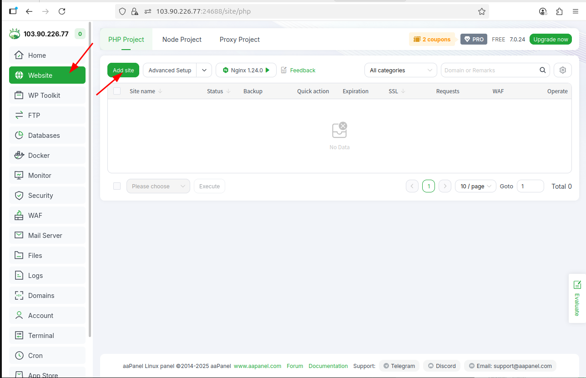

# NGUYỄN MINH CHIẾN - NỘI DUNG TÌM HIỂU 15/09/2025
## I. aaPanel
### Khái niệm

aaPanel là một bảng điều khiển (control panel) miễn phí và mã nguồn mở, được phát triển bởi BT.cn, một công ty công nghệ Trung Quốc. Đây là phiên bản quốc tế hóa của BAOTA Panel, một trong những giao diện quản lý web hosting phổ biến nhất tại Trung Quốc.

aaPanel giúp đơn giản hóa quá trình quản lý máy chủ Linux thông qua giao diện web trực quan. Người dùng có thể dễ dàng cài đặt và vận hành các dịch vụ quan trọng như web server (LAMP/LEMP), FTP, cơ sở dữ liệu, quản lý tệp tin, thiết lập backup tự động và giám sát hiệu suất hệ thống. Ngoài ra, aaPanel còn hỗ trợ cấu hình sẵn các rule cho Nginx, giúp tối ưu hiệu năng khi triển khai website hoặc ứng dụng.

Control panel này hoạt động tốt trên nhiều bản phân phối Linux phổ biến như Ubuntu, CentOS, Debian… và hỗ trợ đa ngôn ngữ, phù hợp với cả người mới và quản trị viên chuyên nghiệp. 
### Cài đặt aaPanels
- Cập nhật hệ thống trước khi cài đặt
```bash
sudo apt update && sudo apt upgrade -y
```
- Chạy lệnh sau để download và cài đặt aaPanel
```bash
wget -O install.sh https://www.aapanel.com/script/install_7.0_en.sh
sudo bash install.sh
```
- Sau khi chạy scripts thành công, aaPanel sẽ cung cấp thông tin đường dẫn và tài khoản mặc định (bao gồm username và password).


- Truy cập vào đường dẫn aaPanel và đăng nhập sử dụng tài khoản được cấp.


- Khi Đặng nhập thành công lần đầu, aaPanel sẽ cung cấp các tùy chọn để cài đặt môi trường như LAMP hoặc LEMP (Nginx, MySQL, PHP). Ở đây em sử dụng LEMP.


### Tạo website với aaPanels
- Ở giao diện, chọn Websie -> add Site để thêm hai website mới:


- Điền các thông tin của website Wordpress và Laravel. Bao gồm domain truy cập, đường dẫn đến thư mục chứa source-code, ftp (nếu muốn gửi file qua ftp), thông tin databases.


- Truy cập vào DocumentRoot của Wordpress và Laravel, sau đó xóa các file mặc định và upload source code của hai websie.


- Cấu hình Databases vào import dữ liệu sử dụng phpmyadmin. Vào Databases -> phpmyadmin -> public access để truy cập vào giao diện phpmyadmin, sau đó đăng nhập bằng tài khoản mặc định của aaPanels.


- Truy cập và import dữ liệu hai databases sql_wp và sql_laravel của hai website.


- Chỉnh sửa thông tin database sao cho khớp với thông tin ban đầu ở các file config cùa laravel (.env) và wordpress (wp-config.php).


- Cập nhật SSL cho wordpress và Laravel: Truy cập vào domain cấu hình của các site. Sau đó vào phần SSL và gắn  các file key,crt của ZeroSSL đã cấp ở các topic trước.


- Lưu ý: Khi cấu hình block site bằng Nginx trong aaPanel, hệ thống mặc định sẽ tạo một file cấu hình rewrite trống để xử lý chuyển hướng URL. Vì vậy, khi truy cập vào các trang con (sub-URL) của ứng dụng, người dùng sẽ gặp lỗi 404 – Not Found. Để khắc phục, cần bổ sung rule rewrite thích hợp bằng cách chỉnh sửa file cấu hình đó.


- Truy cập vào hai website sử dụng domain đã cấu hình để kiểm thử.


## II. Tìm hiểu một số Plugin của WordPress
### 1. All-in-One WP Migration and Backup
#### Khái niệm
All-in-One WP Migration and Backuplà plugin WordPress được tin dùng từ năm 2013, giúp di chuyển và sao lưu toàn bộ website WordPress một cách dễ dàng. Plugin này được sử dụng bởi hàng triệu website trên toàn thế giới, từ blog nhỏ đến các tập đoàn lớn và cơ quan chính phủ. Nó cho phép người dùng xuất và nhập toàn bộ website – bao gồm cơ sở dữ liệu, media, theme và plugin – mà không yêu cầu kỹ năng kỹ thuật phức tạp.

#### Tại sao nên sử dụng All-in-One WP Migration and Backup
Plugin giúp việc di chuyển website WordPress trở nên dễ dàng và nhanh chóng, chỉ với một cú click để xuất toàn bộ website. Quá trình này được thực hiện mà không gây gián đoạn dịch vụ, đảm bảo website vẫn hoạt động bình thường trong suốt quá trình migration.

Plugin tương thích với hầu hết các nhà cung cấp hosting, từ các gói shared hosting giá rẻ đến các server cao cấp, và được thiết kế tối ưu về bộ nhớ, xử lý dữ liệu theo các khối 512KB, thích hợp cho các môi trường có tài nguyên hạn chế. 

Giao diện trực quan của plugin giúp ngay cả những người không có kỹ năng kỹ thuật cũng có thể sử dụng dễ dàng.

All-in-One WP Migration còn hỗ trợ di chuyển giữa nhiều loại cơ sở dữ liệu như MySQL, MariaDB và SQLite, đồng thời được chứng thực là an toàn và đáng tin cậy, được các tập đoàn và tổ chức lớn như Boeing, NASA, Harvard, Stanford, Automattic và nhiều cơ quan chính phủ tin dùng trên toàn thế giới.

#### Export Website bằng plugin
- Trong trường hợp này, plugin đã được cài sẵn và kích và nên ta truy cập vào bảng menu để vào plugin. Chọn xuất (Imporrt) để xuất trang web.


- Ở màn hình export, chọn xuất sang để xuất trang Wordpress ở định dạng phù hợp


- Sau khi chọn loại định dạng, bấm Download để tải trang backup.


- Sau khi export, truy cập vào backup sẽ thấy website được lưu trong đó. Sau này khi cấu hình trang web bị lỗi, có thể sử dụng chức năng restore để  phục hồi trang web về trạng thái cũ.


### 2. Rank Math SEO PRO

#### Khái niệm
là một plugin tối ưu hóa SEO mạnh mẽ dành cho WordPress, giúp website được tối ưu hóa công cụ tìm kiếm (SEO) một cách toàn diện. Plugin này hỗ trợ cả người mới và chuyên gia SEO với giao diện trực quan và các công cụ tự động hóa tối ưu hóa nội dung, meta, sitemap, breadcrumbs và nhiều yếu tố quan trọng khác.

#### Lợi ích của Rank Math SEO PRO

Rank Math SEO PRO giúp nâng cao khả năng hiển thị của website trên các công cụ tìm kiếm như Google, Bing hay Yahoo. Nó tự động kiểm tra và tối ưu các yếu tố SEO quan trọng như tiêu đề, mô tả, từ khóa, hình ảnh, link nội bộ và sitemap. Nhờ đó, bạn tiết kiệm thời gian và công sức so với việc tối ưu thủ công.

Plugin cũng cung cấp báo cáo SEO chi tiết và phân tích nội dung theo thời gian thực, giúp bạn nhận biết ngay các điểm cần cải thiện để nâng thứ hạng website. Đồng thời, Rank Math SEO PRO hỗ trợ schema markup cho rich snippet, giúp trang web hiển thị thông tin hấp dẫn hơn trên kết quả tìm kiếm.

Ngoài ra, plugin có tính năng tự động hóa SEO, gợi ý từ khóa, quản lý redirection, phân tích SEO nâng cao, và tương thích với các plugin nổi tiếng khác như WooCommerce, giúp website thương mại điện tử đạt hiệu quả SEO tối đa.

#### Cài đặt và kích hoạt (Các Plugin khác cũng sẽ được cài đặt tương tự)

- Cài đặt file zip từ trang portal của khách hàng.


- Truy cập plugin trong trang quản trị Wordpress để upload file zip. Sau khi upload sẽ xuất hiện trong danh sách plugin đã cài đặt trong Wordpress.


#### Cấu hình SEO
- Sau khi kích hoạt, thanh menu bên trái sẽ xuất hiện Rank Math SEO. Truy cập vào đó để thiết lập SEO.


- Sau khi thiết lập truy cập lại phần phân tích để xem phân thích trang web.


### 3. MythemeShop

#### Khái niệm
MyThemeShop được biết đến là thương hiệu sản xuất các theme và plugin WordPress phân phối cho người dùng trên toàn thế giới. Tính đến thời điểm hiện tại, MyThemeShop đã sáng tạo ra hơn 83 sản phẩm bao gồm 65 theme và nhiều loại plugin mang lại nhiều tính năng ưu việt.

Theme và plugin của MyThemeShop hỗ trợ nhiều tính năng, tương thích với mọi website và thời gian tải website nhanh chóng. Có thể thấy, được tích hợp tính năng tối ưu hóa cho các công cụ tìm kiếm là ưu điểm vượt trội mang lại doanh thu cho các theme của MyThemeShop. Các theme của MyThemeShop hoạt động rất tốt trong việc nâng cao tốc độ tải trang, và một số theme đã xếp hạng ở vị trí TOP đầu trong một số bài kiểm tra tốc độ tải trang của theme WordPress hiện nay.

### Cài đặt, kích hoạt và cấu hình MyThemeShop
- Download một theme bất kỳ từ trang download sau đó upload lên theme.


- Sau khi upload kích hoạt theme và truy cập vào website


- Ở đây, do website đang sử dụng một theme khác là Flatsome nên khi active theme khác sẽ bị lỗi do cấu hình không khớp. Trường hợp này cũng tương tự khi sử dụng plugin Divi hay Elementor.


### 4. Elementor

#### Khái niệm

Elementor là plugin page builder dành cho WordPress. Plugin này giúp người dùng tạo các trang WordPress một cách dễ dàng bằng visual editor. Hiểu đơn giản rằng, Elementor sẽ giúp người dùng thiết kế website trực quan và có thể dễ nhìn thấy sự thay đổi trên trang web của mình ngay lập tức. Đặc biệt, nếu không am hiểu về code, người dùng cũng hoàn toàn có thể sử dụng Elementor để tạo website cho riêng mình.

Plugin Elementor là một giải pháp all-in-one, cho phép người dùng kiểm soát mọi thứ trong việc thiết kế website trên một nền tảng duy nhất. Người dùng có thể tùy chỉnh website để phù hợp với thương hiệu của mình bằng các hiệu ứng chuyển động, nhiều font chữ và background. Ngoài ra, Elementor còn có những tiện ích tùy chỉnh liên quan đến văn bản, hình ảnh, đánh giá của khách hàng, thanh trượt, biểu tượng,… được tích hợp sẵn và cực kỳ dễ sử dụng.

### 5. Divi Theme

#### Khái niệm

Divi là theme WordPress được phát triển bởi Elegant Themes, đây là một trong những lựa chọn hàng đầu cho việc xây dựng và thiết kế website trên nền tảng WordPress. Không chỉ sở hữu thiết kế đẹp mắt, tốc độ tải nhanh và tối ưu cho SEO, Divi WordPress theme còn có nhiều tính năng hữu ích, đặc biệt là khả năng tạo ra template không giới hạn.

Divi tích hợp sẵn plugin Divi Builder và cung cấp nhiều mẫu website có sẵn từ nhiều lĩnh vực khác nhau, giúp người dùng dễ dàng tạo ra các mẫu template riêng tùy vào mục đích sử dụng. Ngoài ra, hệ thống Modules và Premade Layouts đa dạng, mang đến cho người dùng nhiều tùy chọn để sử dụng hoặc chỉnh sửa website theo ý thích.

Ngoài ra, Divi tích hợp một bộ công cụ giúp người dùng dễ dàng tối ưu hóa website nhằm thứ hạng cao trên các công cụ tìm kiếm. Không chỉ vậy, việc tích hợp các công cụ như WooCommerce cũng giúp người dùng có thể xây dựng các cửa hàng trực tuyến dễ dàng, thuận tiện.

### 6. Wordpress OpTimized Cache

WP Optimize là một plugin WordPress hiệu năng cao, giúp làm sạch và tối ưu hóa cơ sở dữ liệu, nén hình ảnh và lưu trữ trang web vào bộ nhớ đệm để tăng tốc độ và SEO. WP Optimize được xây dựng trên nhiều công cụ lưu trữ trên thế giới, cho trải nghiệm tốt nhất cho trang web. 

WP Optimize là một plugin dễ sử dụng và tương thích với hầu hết các theme và plugin WordPress khác. Người dùng có thể tải về và cài đặt WP Optimize từ kho plugin WordPress hoặc từ website chính thức của nó. Sau khi kích hoạt plugin, bạn sẽ thấy một menu WP Optimize trên bảng điều khiển WordPress của bạn. Bạn có thể truy cập vào các mục con để thiết lập và sử dụng các tính năng của plugin.

#### Cài đặt và kích hoạt Optimized Cache
- Truy cập vào phần Plugin để cài đặt và kích hoạt.


- TỐi ưu hóa databases. Chức năng tối ưu cơ sở dữ liệu sẽ dọn dẹp các dữ liệu không cần thiết như bản nháp cũ, bản ghi tự động lưu, hoặc các comment spam. Việc này giúp giảm dung lượng lưu trữ và tăng tốc độ truy vấn cơ sở dữ liệu.


- TỐi ưu hóa hình ảnh bằng cách  sử dụng công cụ nén hình ảnh được tích hợp sẵn trong plugin. Hình ảnh sau khi nén sẽ giảm dung lượng nhưng vẫn giữ được chất lượng hiển thị, từ đó rút ngắn thời gian tải trang và giảm băng thông tiêu thụ.


- Tối ưu hóa cache (bộ nhớ đệm). Cache giúp lưu các phiên bản tĩnh của trang web, giảm tải cho máy chủ và tăng tốc độ phản hồi khi người dùng truy cập.


- Tối ưu mã CSS và JavaScript. Chức năng này sẽ nén và gộp các tệp CSS, JS để giảm số lượng yêu cầu tới máy chủ, đồng thời loại bỏ khoảng trắng, ký tự thừa, giúp trang tải nhanh hơn.


### 7. LiteSpeed Cache

LiteSpeed Cache (hay LSCache) là một giải pháp bộ nhớ đệm chuyên dụng cho website chạy trên nền tảng Web Server LiteSpeed – một trong những web server tốt nhất hiện nay. So sánh với các đối thủ như Apache hay Nginx, LiteSpeed vượt trội hơn về tốc độ load, khả năng chịu tải cũng như xử lý dữ liệu.

Việc tích hợp plugin LSCache vào LiteSpeed giúp gia tăng thêm tốc độ load web nhằm nâng cao hiệu suất hoạt động vượt trội so với những webserver khác trên thị trường. Đó cũng là lý do mà plugin này được nhiều webmaster ưa chuộng và sử dụng ở thời điểm hiện tại.

#### Các trường hợp sử dụng LiteSpeed Cache

- **Website có lượng truy cập lớn, nhiều người dùng đồng thời**: Khi lượng request tăng đột biến, LiteSpeed tận dụng khả năng xử lý song song tốt hơn so với Apache truyền thống, giảm tình trạng nghẽn kết nối. Điều này giúp hệ thống duy trì độ ổn định và thời gian phản hồi nhanh ngay cả trong giờ cao điểm.

- **Website cần tận dụng tối đa bộ nhớ đệm (cache)**: LiteSpeed tích hợp sẵn cơ chế LSCache, hoạt động hiệu quả với WordPress, Joomla, Magento... Cơ chế này lưu trữ trang đã render, giảm tải cho PHP và database, nhờ đó thời gian tải trang được rút ngắn đáng kể.

- **Hệ thống thương mại điện tử hoặc ứng dụng cần tốc độ phản hồi nhanh**: Với các trang bán hàng trực tuyến, mỗi mili-giây đều ảnh hưởng đến trải nghiệm người dùng và tỉ lệ chuyển đổi. LiteSpeed hỗ trợ HTTP/3, nén dữ liệu và xử lý request nhanh, giúp cải thiện hiệu suất truy cập.

- **Hạ tầng hosting chia sẻ hoặc môi trường nhiều website cùng chạy**: Trong môi trường shared hosting, LiteSpeed quản lý tài nguyên tốt hơn, hạn chế việc một website tiêu tốn quá nhiều CPU/RAM ảnh hưởng đến các website khác.

- **Doanh nghiệp muốn giảm chi phí hạ tầng**:  Nhờ tối ưu bộ nhớ đệm và khả năng xử lý cao, LiteSpeed có thể phục vụ nhiều kết nối trên cùng một máy chủ, từ đó giảm nhu cầu nâng cấp phần cứng hoặc mở rộng số lượng server.

#### Cài đặt và kích hoạt LiteSpeed Cache
- Truy cập vào plugin, tìm kiếm plugin LiteSpeed Cache sau đó cài đặt và kích hoạt plugin.


- Truy cập vào giao diện chính LiteSpeed Cache.


- LiteSpeed Cache cần QUIC.cloud để sử dụng các dịch vụ. Kích hoạt dịch vụ QUIC.cloud


- Sau khi kích hoạt QUIC.Cloud, kích hoạt dịch vụ CDN. CDN (Content Delivery Network – Mạng phân phối nội dung) là một hệ thống các máy chủ được đặt ở nhiều vị trí địa lý khác nhau trên thế giới, có nhiệm vụ lưu trữ (cache) và phân phối nội dung của website đến người dùng một cách nhanh nhất.


- Có hai cách để cấu hình CDN:
    - Phương án thứ nhất là sử dụng CNAME. Ở cách này, toàn bộ hệ thống DNS hiện tại vẫn được giữ nguyên. Chỉ cần tạo thêm một bản ghi CNAME trỏ từ tên miền hoặc subdomain về địa chỉ mà QUIC.cloud cung cấp. Đây là lựa chọn phù hợp khi hạ tầng DNS đã được triển khai sẵn hoặc đang sử dụng dịch vụ DNS bên ngoài như PA, Cloudflare, hoặc PowerDNS tự quản lý. Việc thay đổi nhỏ này giúp tận dụng CDN mà không ảnh hưởng đến các bản ghi DNS khác.

    - Phương án thứ hai là sử dụng DNS của QUIC.cloud cho tên miền gốc. Cách này yêu cầu chuyển quyền quản lý DNS về QUIC.cloud. Hệ thống QUIC.cloud sẽ tự động tạo một vùng DNS (DNS Zone), quét và sao chép các bản ghi DNS hiện có, sau đó quản lý chúng trực tiếp. Đây là cách cấu hình đơn giản nhất để tận dụng đầy đủ tính năng của QUIC.cloud, nhưng đồng nghĩa với việc toàn bộ quản lý DNS sẽ được thực hiện tại nền tảng QUIC.cloud thay vì hệ thống hiện tại.


