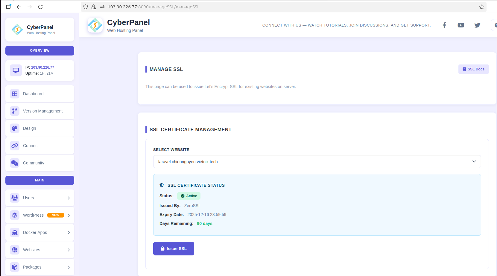

# NGUYỄN MINH CHIẾN - NỘI DUNG TÌM HIỂU 17/09/2025
## I. CyberPanel
### Khái niệm
CyberPanel là một control panel miễn phí dành cho Linux, có tích hợp với web server OpenLiteSpeed giúp quản trị máy chủ web và các website sử dụng PHP, MySQL một cách hiệu quả. Được phát triển bởi LiteSpeed Technologies, CyberPanel cung cấp một giao diện quản trị trực quan, giúp đơn giản hóa các tác vụ phức tạp.

Với CyberPanel, người dùng có toàn quyền kiểm soát máy chủ của mình, từ việc cài đặt ứng dụng, quản lý tài nguyên đến mở rộng hệ thống, mọi thứ đều được thực hiện một cách dễ dàng và linh hoạt. CyberPanel không chỉ là một công cụ mà là một trợ thủ đắc lực giúp  tối ưu hóa hiệu suất website. Thống kê cho thấy CyberPanel đang nắm giữ khoảng 5-10% thị phần trong lĩnh vực control panel miễn phí và mã nguồn mở.

### Một số tính năng nổi bật
Các tính năng nổi bật:

- Hỗ trợ Tiếng Việt (có sự quản lý bởi cyberpanel.vn).
- Giao diện website hiện đại, trực quan dễ sử dụng.
- Tùy chọn hỗ trợ OpenLiteSpeed hoặc LiteSpeed Enterprise.
- Hỗ trợ LSCache.
- Hỗ trợ Multi PHP.
- Hỗ trợ Memcached và Redis.
- Hỗ trợ MariaDB (có thể tùy chọn phiên bản 10.0, 10.1, 10.2, 10.3, 10.4).
- Tự động gia hạn free SSL – Let’s Encrypt.
- Có sẵn Lightweight DNS Server, Email Server (Rainloop Webmail), giao diện Command Line, FirewallD, SpamAssassin, ModSecurity,…
- Hỗ trợ cài đặt WordPress, Drupal, Magento,… trong một click chuột.
- Hỗ trợ Git (Github, Gitlab).

### Cài đặt CyberPanel
- Cập nhật hệ thống trước khi cài đặt
```bash
sudo apt update && sudo apt upgrade -y
```
- Nhập lệnh dưới đây để download và cài đặt CypberPanel
```bash
sh <(curl https://cyberpanel.net/install.sh || wget - O - https://cyberpanel.net/install.sh)
```


- Sau khi cài đặt thành công, CypberPanel sẽ cung cấp tài khoản admin mặc định để đăng nhập. Restart lại server.


- Sau khi restart và đăng nhập lại bằng ssh. Vào trình duyệt truy cập vào CyberPanel và đăng nhập bằng tài khoản admin vừa được tạo.


## II. Tạo website với CyberPanel
### Wordpress
- Vào phần Website -> Create Website. Điền các thông tin cần thiết để tạo web.


- Sau khi tạo website, CyberPanel sẽ tự động thiết lập SSL của Zero SSL vào domain.


- Truy cập List Website để xem thông tin website vừa tạo, vào phần File Manager để upload source WordPress. Vì DocRoot mặc định của CyberPanel khi tạo website là public_html nên cần upload source code ở thư mục đó.


- Cấu hình file .htaccess của Wordpress.


- Tạo database, database user và password cho Wordpress. Sau đó import cơ sở dữ liệu.


- Cấu hình wp-config.php theo thông tin database vừa tạo.


- Truy cập vào website để kiểm thử.


### Laravel
- Vào phần Website -> Create Website. Điền các thông tin cần thiết để tạo web.


- Sau khi tạo website, CyberPanel sẽ tự động thiết lập SSL của Zero SSL vào domain.


- Truy cập List Website để xem thông tin website vừa tạo, vào phần File Manager để upload source Laravel. Vì DocRoot mặc định của CyberPanel khi tạo website là public_html nên cần upload source code ở thư mục đó.


- Tạo database, database user và password cho Laravel. Sau đó import cơ sở dữ liệu.


- Vì Laravel chỉ chạy trong thư mục public, nên ta cấu hình lại đường dẫn docRoot trỏ tới thư mục public.


- Cấu hình .env theo thông tin database vừa tạo.


- Truy cập vào website để kiểm thử.


## III. Passproxy qua OpenLiteSpeed
- Thiết lập tài khoản admin để đăng nhập OpenLiteSpeed.
```bash
sudo /usr/local/lsws/admin/misc/admpass.sh
```
- Truy cập trình duyệt ở https://ip:7080 đăng nhập vào OpenLiteSpeed. Sử dụng thông tin tài khoản đã tạo ở bước trước để đăng nhập.


- Tạo một proxy mới. Lựa chọn Type là WebServer. Sau đó điền các thông tin và restart lsws để áp dụng cấu hình.


- Truy cập vào Virtual Host để tạo context proxy /api. Phần Type để là Proxy. Sau đó điền các thông tin địa chỉ app OpenLiteSpeed sẽ proxy đến.


- Tạo một app bằng flask lắng nghe trên port 5000 với địa chỉ localhost. Sau đó truy cập vào đường dẫn https://wp.chiennguyen.vietnix.tech/api/ để kiểm thử .


