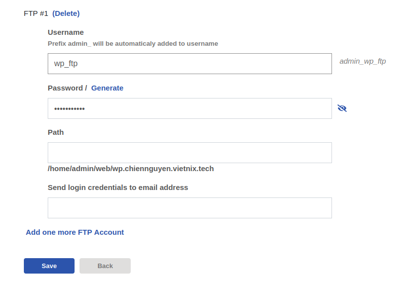

# NGUYỄN MINH CHIẾN - NỘI DUNG TÌM HIỂU 18/09/2025
## I.VestaCP
### Khái niệm
VestaCP là một phần mềm quản lý máy chủ mã nguồn mở miễn phí, giúp người dùng quản trị máy chủ dễ dàng thông qua giao diện đơn giản và thân thiện.
Với VestaCP, người dùng có thể quản lý các dịch vụ quan trọng trên máy chủ như ứng dụng web, cơ sở dữ liệu, tài khoản FTP, email, và nhiều dịch vụ khác mà không cần quá nhiều kiến thức kỹ thuật.

Phần mềm này tương thích với nhiều hệ điều hành phổ biến như Ubuntu, Debian, CentOS, RHEL, và hỗ trợ đa dạng các phiên bản PHP, giúp người dùng linh hoạt hơn trong quá trình vận hành hệ thống.

VestaCP nổi bật với giao diện đơn giản và thân thiện, giúp người dùng dễ dàng quản lý máy chủ mà không cần nhiều kiến thức kỹ thuật chuyên sâu. Với khả năng quản trị thông qua giao diện web trực quan, VestaCP cho phép người dùng quản lý toàn bộ hệ thống từ xa một cách thuận tiện.

### Một số tính năng nổi bật
Các tính năng chung của VestaCP bao gồm:
- Cài đặt tác vụ định kỳ
- Quản lý Web Domains
- Sao lưu dữ liệu
- Quản lý cơ sở dữ liệu
- Quản lý DNS

Các tính năng của VestaCP cho mail server bao gồm:
- Dovecot
- RoundCube
- SpamAssassin
- Exim

Các tính năng khác của VestaCP bao gồm:
- Giấy phép GPL v3
- FTP server (VsFTPD hoặc ProFTPD)
- 26 ngôn ngữ cho giao diện web
- Chứng chỉ SSL
- Quản lý tập tin (file manager)
- Log truy cập (access log) và log lỗi (error log)
- Tường lửa (firewall)
- Giao diện dòng lệnh (CLI) và API
- 26 ngôn ngữ cho giao diện web

### Cài đặt VestaCP
#### WordPress

- cài đặt VestaCP dễ dàng hơn nhiều so với bất kỳ hosting control panel nào khác. Tất cả những gì cần làm chỉ là tải xuống tập lệnh cài đặt VestaCP và chạy nó.


- Sau khi cài đặt thành công sẽ hiện thông tin tài khoản và mật khẩu để đăng nhập


- Truy cập vào trình duyệt tại https://103.90.226.77:8083, đăng nhập bằng tài khoản vừa được tạo sau khi cài đặt.


- Truy cập vào web để tạo một website mới cho wordpress (laravel cũng tương tự). Điền các thông tin liên quan tới domain, proxy, ip, ssl(crt, key).


- Tạo database và điền các thông tin về cho Wordpress (Laravel cũng thực hiện tương tự). Sau đó truy cập phpmyadmin sử dụng tài khoản đã tạo để đăng nhập và import CSDL


- Upload Source code: tạo tài khoản ftp để đăng nhập và upload từ máy client. Sau đó chuyển source-code vào docRoot của web (`/home/admin/web/wp.chiennguyen.vietnix.tech/public_html`)




- Cấu hình wp-config.php theo thông tin database vừa tạo.


- Truy cập website để kiểm thử web.


#### Laravel
- Đối với Laravel, các bước thực hiện cũng sẽ tương tự như WordPress, nhưng cần lưu ý vấn đề sau.

    - PHP Version: Do Source-code Laravel sử dụng PHP 8.1 nhưng theo web template apache mặc định VestaCp chỉ chạy phiên bản PHP 7.2 nên khi truy cập website sẽ bị lỗi. Để khắc phục, cần tạo một PHP-FPM pool riêng cho domain Laravel và chỉnh sửa web template để trỏ tới PHP 8.1. Nếu không, khi truy cập web sẽ xuất hiện lỗi cú pháp do phiên bản PHP cũ không nhận biết các tính năng mới của Laravel.

    - Cài đặt Php-Installer:
    ```bash
    wget -nv -O ./vesta-inst-php.sh https://c.myvestacp.com/tools/multi-php-install.sh
    ```
    - Truy cập vào file cài đặt để edit scripts.
    ```bash
    mcedit ./vesta-inst-php.sh
    ```
    - Đánh số 1 vào PHP-version cần cài đặt.

    

    - Sau khi đánh số, lưu và thoát và nhập lệnh này để thực hiện cài đặt.
    ```bash
    sudo bash ./vesta-inst-php.sh
    ```

    - Sau khi cài đặt, truy cập vào web -> laravel.chiennguyen.vietnix.tech. Chọn edit và kéo xuống web template sẽ có thêm php-fpm 8.1. Chọn template này và nhấn Save để áp dụng cho site. Việc này sẽ đảm bảo Apache của VestaCP sử dụng PHP 8.1 FPM cho site Laravel, thay vì PHP mặc định (7.2).

    

    - Truy cập website vào kiểm thử.

    